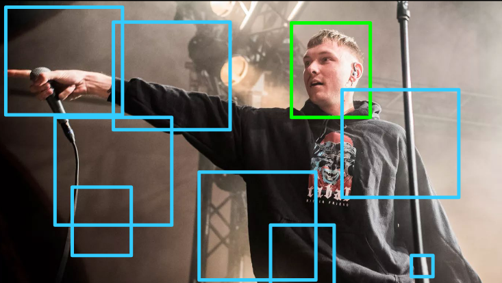

***Solution is now available! Download the full solution from here:*** [Solution](../downloads/sol_material-10.zip){ .md-button .md-button--primary .inline-button }

# Exercise 10 - Viola Jones type object detection and Snapchat lenses


## Introduction
---
In this exercise, we take a look at the use case of the widely deployed [Viola-Jones algorithm](https://ieeexplore.ieee.org/document/990517) - a method that enables real-time face detection. Object detection is a core problem within computer vision, and with its introduction in 2001, Viola Jones became the first face detection algorithm used in real-time. Although old, the method is still applicable today, as to can produce relatively high accuracy in conjunction with its low compute requirement, making it an attractive alternative to more modern frameworks such as YOLO v3. The algorithm has later been integrated within large applications such as *Snapchat*, which used the framework in the popular *Snapchat Lenses* widget. Later on, we'll explore how face detection can be adopted for such uses. Similarly we'll show, that the algorithm can be adapted to detect other object classes.




!!! NOTE "CascadeClassifier" 
    In OpenCV, the task of Viola-Jones-style object detection is referred to as cascade classification. We will use the two terms interchangeably, although there are a few differences as compared to the original Viola-Jones paper. Disregarding details, from an intuitive standpoint, the two approaches are close to similar.

## Exercises outline

- In ***part 1*** you will work on intuitively interpreting the building blocks of Viola-Jones, namely the Haar-features, and relate the scale-parameter to the detection quality.
- In ***part 2*** you will extract the value of a chosen Haar feature, gaining an understanding of the underlying mechanism of Viola Jones feature extraction.
- In ***part 3*** you are given the opportunity to **optionally** train your own classifier.
- In ***part 4*** you will gain familiarity with some pretrained Viola-Jones type detectors provided by `OpenCV` and learn how to use them for face- and eye-detection.
- In ***part 5*** you will design and implement a Viola-Jones version of ***Snapchat lenses***.

## Learning goals

- Be able to use opencv pretrained cv2::CascadeClassifier()
- Count the number of detections from a pretrained cv2::CascadeClassifier()
- Compute outputs of haar features using an integral image
- Interpret how simple Haar-features relate to common properties of the class to be detected
- Identify failure modes of Viola-Jones with respect to simple image conditions such as lighting, object transformations, distance and resolution
- Relate and tune the scale of a Viola-Jones object detector to a specific task, considering object sizes
- Understand how the scale parameter influences the run-time of a cv2::CascadeClassifier()

## Installing Python packages

In this exercise, we will only use libraries which you already should have installed. The most important one is `opencv`, which can be installed into your existing virtual environment using:

```pip install opencv-python```

We will use the virtual environment from the previous exercise (course02503).


## Getting The Data

Download the data you'll need for this exercise by clicking here: [Data](../downloads/material-10.zip){ .md-button .md-button--primary .inline-button }

Alternatively, you can also fetch the data for the whole course through the [Image Analysis GitHub repository](https://github.com/RasmusRPaulsen/DTUImageAnalysis). See the [Data and GitHub](../ex1-setup/data_and_github.md) section for more information. If you're using Git, it may be wise run:

```git pull```

As this will fetch updates to the material, which may happen throughout the course.

