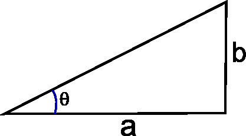
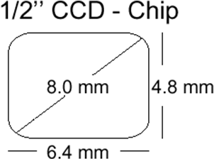

## Computing camera parameters

### Exercise 1

Explain how to calculate the angle $\theta$ when $a$ and $b$ is given
in the figure below. Calculate $\theta$ (in degrees) when
$a = 10$ and $b=3$ using the function `math.atan2()`. Remember to import `math` and find out what `atan2` does.



<!-- START_SOLUTION 1 -->
??? tip "Solution 1"
    ```py

    import numpy 
    print(np.zeros(1337,1337).shape) #example solution
    ```
<!-- END_SOLUTION 1 -->

### Exercise 2

Create a Python function called `camera_b_distance`.

The function should accept two arguments, a focal length f and an
object distance g. It should return the distance from the lens to
where the rays are focused (b) (where the CCD should be placed)

The function should start like this:

```python
def camera_b_distance(f, g):
    """
    camera_b_distance returns the distance (b) where the CCD should be placed
    when the object distance (g) and the focal length (f) are given
    :param f: Focal length
    :param g: Object distance
    :return: b, the distance where the CCD should be placed
    """
```

It should be based on Gauss' lens equation:
$$\frac{1}{g} + \frac{1}{b} = \frac{1}{f}$$

You should decide if your function should calculate distances in mm or
in meters, but remember to be consistent!

Use your function to find out where the CCD should be placed when the
focal length is 15 mm and the object distance is 0.1, 1, 5, and 15
meters.

What happens to the place of the CCD when the object distance is increased?

<!-- START_SOLUTION 2 -->
??? tip "Solution 2"
    ```py

    import numpy 
    print(np.zeros(2337,2337).shape) #example solution
    ```
<!-- END_SOLUTION 2 -->

## Camera exercise

In the following exercise, you should remember to explain when
something is in mm and when it is in meters. To convert between
radians and degrees you can use:

```
angle_degrees = 180.0 / math.pi * angle_radians
```

### Exercise 3

Thomas is 1.8 meters tall and standing 5 meters from a camera. The
cameras focal length is 5 mm. The CCD in the camera can be seen in
the figure below. It is a 1/2" (inches) CCD chip and the
image formed by the CCD is 640x480 pixels in a (x,y) coordinate system.



It is easiest to start by drawing the scene. The scene should
contain the optical axis, the optical center, the lens, the focal
point, the CCD chip, and Thomas. Do it on paper or even better in a
drawing program.

#### Exercise 3.1: A focused image of Thomas is formed inside the camera. At which distance from the lens?
<!-- START_SOLUTION 3 -->
<!-- END_SOLUTION 3 -->

#### Exercise 3.2: How tall (in mm) will Thomas be on the CCD-chip?
<!-- START_SOLUTION 4 -->
<!-- END_SOLUTION 4 -->

#### Exercise 3.3: What is the size of a single pixel on the CCD chip? (in mm)?
<!-- START_SOLUTION 5 -->
<!-- END_SOLUTION 5 -->

#### Exercise 3.4: How tall (in pixels) will Thomas be on the CCD-chip?
<!-- START_SOLUTION 6 -->
<!-- END_SOLUTION 6 -->

#### Exercise 3.5: What is the horizontal field-of-view (in degrees)?
<!-- START_SOLUTION 7 -->
<!-- END_SOLUTION 7 -->

#### Exercise 3.6: What is the vertical field-of-view (in degrees)?
<!-- START_SOLUTION 8 -->
<!-- END_SOLUTION 8 -->


## Exam preparation 
Below are three example exam exercises related to this weeks material. Work with them, and if you have issues or questions, please ask the TAs, as you will not be able to get help after the last exercise round.

*Exam question 1: A company is making an automated system for fish inspection. They are using a camera with a CCD chip that measures 5.4 x 4.2 mm and that has a focal length of 10 mm. The camera takes photos that have dimensions 6480 x 5040 pixels and the camera is placed 110 cm from the fish, where a sharp image can be acquired of the fish. How many pixels wide is a fish that has a length of 40 cm?*

- [ ] 4364
- [ ] 4135
- [ ] 3213
- [ ] 5612
- [ ] 1872
- [ ] Do not know


<!-- START_SOLUTION 9 -->
<!-- END_SOLUTION 9 -->


*Exam question 2: You have a camera with a focal length of 52 mm and a CCD chip of 8 mm x 6 mm. The image dimensions are 3200 x 2400 pixels. It can be assumed that b = f. From a distance of 10 cm you have taken a sharp picture of an eye with a completely round pupil. The image is thresholded such that only the pupil is visible. You find the area of the pupil to be 416248 pixels. What is the real diameter of the pupil given in millimeters?*

- [ ] 4.2 millimeter
- [ ] 3.5 millimeter
- [ ] 2.9 millimeter
- [ ] 3.8 millimeter
- [ ] 4.4 millimeter
- [ ] Do not know


<!-- START_SOLUTION 10 -->
<!-- END_SOLUTION 10 -->


*Exam question 3: You have a camera with a field-of-view of 35◦ both horizontally and vertically. The cameras focal length is 20 mm and it can be assumed that f = b. What should the height of the CCD chip be, in order to take an image of the whole field-of-view?*

- [ ] 8.2 mm
- [ ] 9.8 mm
- [ ] 13.7 mm
- [ ] 10.1 mm
- [ ] 12.6 mm
- [ ] Do not know

<!-- START_SOLUTION 11 -->
<!-- END_SOLUTION 11 -->