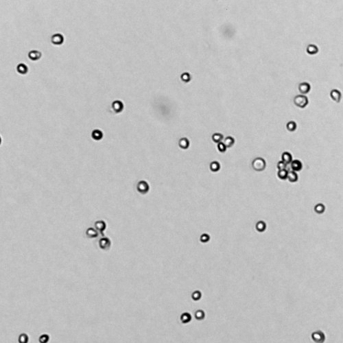
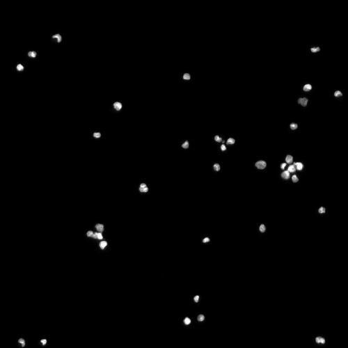

_Latest Page Update: 21-07-2026_

***Solution is now available! Download the full solution from here:*** [Solution](../downloads/sol_material-5.zip){ .md-button .md-button--primary .inline-button }

# BLOB Analysis in Python 

## LEGO Classification

We will start by trying some BLOB analysis approaches on a photo of some Lego bricks: **lego_4_small.png**.

### Exercise 1: Binary image from original image

Read the image, convert it to grayscale and use *Otsus* method to compute and apply a threshold. 

Show the binary image together with the original image.

??? NOTE
    Remember to make sure that your foreground class = `1` and background class = `0`.

<!-- START_SOLUTION 1 -->
??? tip "Solution 1"
    ```py

    import numpy 
    print(np.zeros(1337,1337).shape) #example solution
    ```
<!-- END_SOLUTION 1 -->

### Exercise 2: Remove border BLOBs

Use `segmentation.clear_border` to remove border pixels from the binary image.

<!-- START_SOLUTION 2 -->
??? tip "Solution 2"
    ```py

    import numpy 
    print(np.zeros(2337,2337).shape) #example solution
    ```
<!-- END_SOLUTION 2 -->

### Exercise 3: Cleaning using morphological operations

In order to remove remove noise and close holes, you should do a morphological closing followed by a morphological opening with a disk shaped structuring element with radius 5.

??? TIP
    See [Exercise 4b](https://dtuimageanalysisorg.github.io/DTUImageAnalysis/ex4b/ex4b-morph/) if you are in doubt.

<!-- START_SOLUTION 3 -->
<!-- END_SOLUTION 3 -->

### Exercise 4: Find labels

The actual connected component analysis / BLOB analysis is performed using `measure.label` :

```python
label_img = measure.label(img_open)
n_labels = label_img.max()
print(f"Number of labels: {n_labels}")
```

<!-- START_SOLUTION 4 -->
<!-- END_SOLUTION 4 -->

### Exercise 5: Visualize found labels

We can use the function `label2rbg` to create a visualization of the found BLOBS. Show this together with the original image.

<!-- START_SOLUTION 5 -->
<!-- END_SOLUTION 5 -->

### Exericse 6: Compute BLOB features

It is possible to compute a wide variety of BLOB features using the `measure.regionprops` function:

```python
region_props = measure.regionprops(label_img)
areas = np.array([prop.area for prop in region_props])
plt.hist(areas, bins=50)
plt.show()
```

<!-- START_SOLUTION 6 -->
<!-- END_SOLUTION 6 -->

### Exercise 7: Exploring BLOB features

There is an example program called `Ex5-BlobAnalysisInteractive.py` in the [exercise material folder](https://github.com/RasmusRPaulsen/DTUImageAnalysis/tree/main/exercises/ex5-BLOBAnalysis/data).

With that program, you can explore different BLOB features interactively. It requires installation of `plotly`:

```
conda install -c plotly plotly=6.0.0
```

<!-- START_SOLUTION 7 -->
<!-- END_SOLUTION 7 -->

## Cell counting

The goal of this part of the exercise, is to create a small program that can automatically count the number of cell nuclei in an image.

The images used for the exercise is acquired by the Danish company [Chemometec](https://chemometec.com/) using their image-based cytometers. A cytometer is a machine used in many laboratories to do automated cell counting and analysis. An example image can be seen in below where U2OS cells  (human bone cells) have been imaged using ultraviolet (UV) microscopy and a fluorescent staining method named DAPI. Using DAPI staining only the cell nuclei are visible which makes the method very suitable for cell counting.

<div class="grid cards" markdown>

<a href="img1.png" class="glightbox">

</a>

<a href="img2.png" class="glightbox">

</a>

</div>

**U2OS cells**: Left image is acquired using UV microscopy and the right is the corresponding DAPI image.

The raw images from the Cytometer are 1920x1440 pixels and each pixel is 16 bit (values from 0 to 65535). The resolution is 1.11 $\mu m$ / pixel.

In this exercise, you need to install the python package imagecodecs to read a .tiff file:
```Shell
conda install imagecodecs
```

To make it easier to develop the cell counting program we start by working with smaller areas of the raw images. The images are also converted to 8 bit grayscale images:

```python
in_dir = "data/"
img_org = io.imread(in_dir + 'Sample E2 - U2OS DAPI channel.tiff')
# slice to extract smaller image
img_small = img_org[700:1200, 900:1400]
img_gray = img_as_ubyte(img_small) 
io.imshow(img_gray, vmin=0, vmax=150)
plt.title('DAPI Stained U2OS cell nuclei')
io.show()
```

As can be seen we use *slicing* to extract a part of the image. You can use `vmin` and `vmax` to visualise specific gray scale ranges (0 to 150 in the example above). Adjust these limits to find out where the cell nuclei are most visible.

Initially, we would like to apply a threshold to create a binary image where nuclei are foreground. To select a good threshold, inspect the histogram:

```python
# avoid bin with value 0 due to the very large number of background pixels
plt.hist(img_gray.ravel(), bins=256, range=(1, 100))
io.show()
```

### Exercise 8: Threshold selection
Select an appropriate threshold, that seperates nuclei from the background. You can set it manually or use *Otsus* method.

Show the binary image together with the original image and evaluate if you got the information you wanted in the binary image.

It can be seen that there is some noise (non-nuclei) present and that some nuclei are connected. Nuclei that are overlapping very much should be discarded in the analysis. However, if they are only touching each other a little we can try to separate them. More on this later.

To make the following analysis easier the objects that touches the border should be removed.

<!-- START_SOLUTION 8 -->
<!-- END_SOLUTION 8 -->

### Exercise 9: Remove border BLOBS

Use `segmentation.clear_border` to remove border pixels from the binary image.

To be able to analyse the individual objects, the objects should be
labelled.

```python
label_img = measure.label(img_c_b)
image_label_overlay = label2rgb(label_img)
show_comparison(img_org, image_label_overlay, 'Found BLOBS')
```

In this image, each object has a separate color - does it look reasonable?

<!-- START_SOLUTION 9 -->
<!-- END_SOLUTION 9 -->

### Exercise 10: BLOB features

The task is now to find some **object features** that identify the cell nuclei and let us remove noise and connected nuclei. We use the function `regionprops` to compute a set of features for each object:

```python
region_props = measure.regionprops(label_img)
```

For example can the area of the first object be seen by: `print(region_props[0].area)`.

A quick way to gather all areas:

```python
areas = np.array([prop.area for prop in region_props])
```

We can try if the area of the objects is enough to remove invalid object. Plot a histogram of all the areas and see if it can be used to identify well separated nuclei from overlapping nuclei and noise. You should probably play around with the number of bins in your histogram plotting function.

<!-- START_SOLUTION 10 -->
<!-- END_SOLUTION 10 -->

### Exercise 11: BLOB classification by area

Select a minimum and maximum allowed area and use the following to visualise the result:

```python
min_area =
max_area =

# Create a copy of the label_img
label_img_filter = label_img
for region in region_props:
	# Find the areas that do not fit our criteria
	if region.area > max_area or region.area < min_area:
		# set the pixels in the invalid areas to background
		for cords in region.coords:
			label_img_filter[cords[0], cords[1]] = 0
# Create binary image from the filtered label image
i_area = label_img_filter > 0
show_comparison(img_small, i_area, 'Found nuclei based on area')
```

Can you find an area interval that works well for these nuclei?

<!-- START_SOLUTION 11 -->
<!-- END_SOLUTION 11 -->

### Exercise 12: Feature space

Extract all the perimeters of the BLOBS:

```python
perimeters = np.array([prop.perimeter for prop in region_props])
```

Try to plot the areas versus the perimeters. 

<!-- START_SOLUTION 12 -->
<!-- END_SOLUTION 12 -->

### Exercise 13: BLOB Circularity

We should also examine if the shape of the cells can identify them. A good measure of how circular an object is can be computed as:

$$
f_\text{circ} = \frac{4 \pi A}{P^2},
$$

where $A$ is the object area and $P$ is the perimeter. A circle has a circularity close to 1, and very-non-circular object have circularity close to 0.

Compute the circularity for all objects and plot a histogram.

Select some appropriate ranges of accepted circularity. Use these ranges to select only the cells with acceptable areas and circularity and show them in an image.

<!-- START_SOLUTION 13 -->
<!-- END_SOLUTION 13 -->

### Exercise 14: BLOB circularity and area

Try to plot the areas versus the circularity. What do you observe?

Extend your method to return the number (the count) of well-formed nuclei in the image.

<!-- START_SOLUTION 14 -->
<!-- END_SOLUTION 14 -->

### Exercise 15: large scale testing
Try to test the method on a larger set of training images. Use slicing to select the different regions from the raw image. 

<!-- START_SOLUTION 15 -->
<!-- END_SOLUTION 15 -->

### Exercise 16: COS7 cell classification

Try your method on the **Sample G1 - COS7 cells DAPI channel.tiff** image.  COS7 cells are [African Green Monkey Fibroblast-like Kidney Cells](https://cos-7.com/) used for a variety of research purposes.

<!-- START_SOLUTION 16 -->
<!-- END_SOLUTION 16 -->

### Exercise 17: Handling overlap

In certain cases cell nuclei are touching and are therefore being treated as one object. It can sometimes be solved using for example the morphological operation **opening** before the object labelling. The operation **erosion** can also be used but it changes the object area.

<!-- START_SOLUTION 17 -->
<!-- END_SOLUTION 17 -->


## Exam preparation 
Below are some example exam exercises related to this weeks material. Work with them, and if you have issues or questions, please ask the TAs, as you will not be able to get help after the last exercise round.

#### 02502 Image Analysis Exam Fall 2022: finding mini figures 

The company, PaintMyMiniz, would like to have a system that can automatically count the number of mini figures standing on a white plate. They have therefore called on your expertise. You decide to solve the task using BLOB analysis. Your first system works like this:

1. Converts the input photo from RGB to gray scale
2. Computes a threshold using Otsu's method
3. Computes a binary image by setting all pixels below the threshold to foreground
and the rest to background
4. Removes BLOBs that are connected to the edges of the image
5. Computes all BLOBs in the image
6. Computes the area and the perimeter of all found BLOBs
   
You start by testing the system on an example photo (***data/figures.png***).

*Exam question 1: You compute the area of all the BLOBs in the image. How many BLOBs have an area larger than 13000 pixels?*

- [ ] 5
- [ ] 4
- [ ] 1
- [ ] 3
- [ ] Do not know
- [ ] 2

<!-- START_SOLUTION 18 -->
<!-- END_SOLUTION 18 -->

*Exam question 2: You find the BLOB with the largest area. What is the perimeter of this BLOB?*

- [ ] 1589
- [ ] 1234
- [ ] 2034
- [ ] 1998
- [ ] 1679
- [ ] Do not know
  
<!-- START_SOLUTION 19 -->
<!-- END_SOLUTION 19 -->


## References
- [sci-kit image label](https://scikit-image.org/docs/stable/api/skimage.measure.html#skimage.measure.label)
- [sci-kit image region properties](https://scikit-image.org/docs/stable/api/skimage.measure.html#skimage.measure.regionprops)
- [Measure region properties](https://scikit-image.org/docs/dev/auto_examples/segmentation/plot_regionprops.html)

