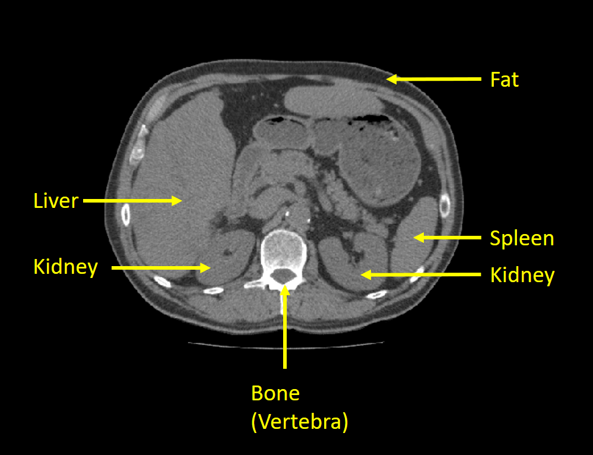
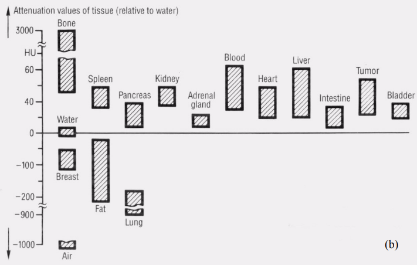

***Solution is now available! Download the full solution from here:*** [Solution](../downloads/sol_material-6.zip){ .md-button .md-button--primary .inline-button }

## Abdominal computed tomography

The images in this  exercise are DICOM images from a computed tomography (CT) scan of the abdominal area. An example can be seen below, where the anatomies we are working with are marked. You should 

A CT scan is normally a 3D volume with many slices, but in this exercise, we will only work with one slice at a time. We therefore call one *slice* for an image.

In this exercise, we will mostly focus on the **spleen** but also examine the **liver, kidneys, fat tissue and bone.**

### Hounsfield units

The pixels in the images are stored as 16-bit integers, meaning their values can be in the range of [−32768,  32767]. In a CT image, the values are represented as [**Hounsfield units** (HU)](https://en.wikipedia.org/wiki/Hounsfield_scale). Hounsfield units are used in computed tomography to characterise the X-ray absorption of different tissues. A CT scanner is normally calibrated so a pixel with Hounsfield unit 0 has an absorbance equal to water and a pixel with Hounsfield unit -1000 has absorbance equal to air. Bone absorbs a lot of radiation and therefore have high HU values (300-800) and fat absorbs less radiation than water and has HU units around -100. Several organs have similar HU values since the soft-tissue composition of the organs have similar X-ray absorption. In the figure below (from Erich Krestel, "Imaging Systems for Medical Diagnostics", 1990, Siemens) some typical HU units for organs can be seen. They are, however, not always consistent from scanner to scanner and hospital to hospital. 

