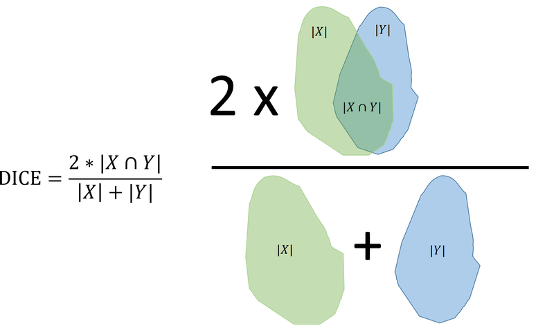

## Explorative analysis of one CT scan

Let us start by examining one of the CT scan slices from the training set. You can read the first slice like this:

```python
in_dir = "data/"
ct = dicom.dcmread(in_dir + 'Training.dcm')
img = ct.pixel_array
print(img.shape)
print(img.dtype)
```

You should visualise the slice, so the organs of interest have a suitable brigthness and contrast. One way is to manipulate the minimum and maximum values proviede to `imshow`.

**Exercise 1**: *The spleen typically has HU units in the range of 0 to 150. Try to make a good visualization of the CT scan and spleen using (replace the question marks with values):*

```python
io.imshow(img, vmin=?, vmax=?, cmap='gray')
io.show()
```

<!-- START_SOLUTION 1 -->
<!-- END_SOLUTION 1 -->

An expert has provided annotations of **bone, fat, kidneys, liver and spleen**. They are stored as *mask* files which is an image with the same size as the input image, where the annotated pixels are 1 and the rest are 0. They are found as **BoneROI.png, FatROI.png, KidneyROI.png, LiverROI and SpleenROI.png**.

You can use the original image and a mask to get the values of the pixels inside the mask:

```python
spleen_roi = io.imread(in_dir + 'SpleenROI.png')
# convert to boolean image
spleen_mask = spleen_roi > 0
spleen_values = img[spleen_mask]
```

**Exercise 2**: *Compute the average and standard deviation of the Hounsfield units found in the spleen in the training image. Do they correspond to the values found in the above figure?*

<!-- START_SOLUTION 2 -->
<!-- END_SOLUTION 2 -->

**Exercise 3**: *Plot a histogram of the pixel values of the spleen. Does it look like they are Gaussian distributed?*

<!-- START_SOLUTION 3 -->
<!-- END_SOLUTION 3 -->

The function [`norm.pdf`](https://docs.scipy.org/doc/scipy/reference/generated/scipy.stats.norm.html) from `SciPy`  represents a Gaussian probability density function (PDF). It can for example be used to plot a Gaussian
distribution with a given mean and standard deviation.

This can be used to create a fitted Gaussian distribution of the spleen values:

```python
n, bins, patches = plt.hist(spleen_values, 60, density=1)
pdf_spleen = norm.pdf(bins, mu_spleen, std_spleen)
plt.plot(bins, pdf_spleen)
plt.xlabel('Hounsfield unit')
plt.ylabel('Frequency')
plt.title('Spleen values in CT scan')
plt.show()
```

Here `mu_spleen` and `std_spleen` are the average and standard deviation of the spleen values.

**Exercise 4**: *Plot histograms and their fitted Gaussians of several of the tissues types. Do they all look like they are Gaussian distributed?*

<!-- START_SOLUTION 4 -->
<!-- END_SOLUTION 4 -->

The fitted Gaussians are good for inspecting class separation and how much the class overlap. Plotting several fitted Gaussians can for example be done like this:

```python
# Hounsfield unit limits of the plot
min_hu = -200
max_hu = 1000
hu_range = np.arange(min_hu, max_hu, 1.0)
pdf_spleen = norm.pdf(hu_range, mu_spleen, std_spleen)
pdf_bone = norm.pdf(hu_range, mu_bone, std_bone)
plt.plot(hu_range, pdf_spleen, 'r--', label="spleen")
plt.plot(hu_range, pdf_bone, 'g', label="bone")
plt.title("Fitted Gaussians")
plt.legend()
plt.show()
```

**Exercise 5**: *Plot the fitted Gaussians of bone, fat, kidneys, liver and spleen. What classes are easy to seperate and which classes are hard to seperate?*

<!-- START_SOLUTION 5 -->
<!-- END_SOLUTION 5 -->

**Exercise 6**: *Define the classes that we aim at classifying. Perhaps some classes should be combined into one class?*

<!-- START_SOLUTION 6 -->
<!-- END_SOLUTION 6 -->

## Minimum distance pixel classification

In the **minimum distance classifier** the pixel value class ranges are defined using the average values of the training values. If you have two classes, the threshold between them is defined as the mid-point between the two class value averages.

In the following, we will define four classes: **background, fat, soft tissue and bone**, where soft-tissue is a combination of the values of the spleen, liver and kidneys. 
We manually set the threshold for background to -200. So all pixels below -200 are set to background.

**Exercise 7**: *Compute the class ranges defining fat, soft tissue and bone.*

<!-- START_SOLUTION 7 -->
<!-- END_SOLUTION 7 -->

You can now use:

```python
t_background = -200
fat_img = (img > t_background) & (img <= t_fat_soft)
```

to create an image where all the pixel that are classified as fat, will be 1 and the rest 0. Here `t_fat_soft` is the threshold between the fat and the soft tissue class.

**Exercise 8**: *Create class images: fat_img, soft_img and bone_img representing the fat, soft tissue and bone found in the image.*

<!-- START_SOLUTION 8 -->
<!-- END_SOLUTION 8 -->

To visualize the classification results you can use:

```python
label_img = fat_img + 2 * soft_img + 3 * bone_img
image_label_overlay = label2rgb(label_img)
show_comparison(img, image_label_overlay, 'Classification result')
```

**Exercise 9**: *Visualize your classification result and compare it to the anatomical image in the start of the exercise. Does your results look plausible?*

<!-- START_SOLUTION 9 -->
<!-- END_SOLUTION 9 -->

## Parametric pixel classification

In the **parametric classifier**, the standard deviation of the training pixel values is also used when determinin the class ranges. In the following, we are also trying to classify **background, fat, soft tissue and bone**.

We start by finding the class ranges by manually inspecting the fitted Gaussians from each class.

As in the last exercise, we can still se the background-fat threshold to be -200.

**Exercise 10**: *Plot the fitted Gaussians of the training values and manually find the intersection between the curves.*

<!-- START_SOLUTION 10 -->
<!-- END_SOLUTION 10 -->

**Exercise 11**: *Use the same technique as in exercise 7, 8 and 9 to visualize your classification results. Did it change compared to the minimum distance classifier?*

<!-- START_SOLUTION 11 -->
<!-- END_SOLUTION 11 -->

An alternative way of finding the class ranges is to test which class has a the highest probability for a given value. The `norm.pdf` function can be used for that. For example:

```python
if norm.pdf(test_value, mu_soft, std_soft) > norm.pdf(test_value, mu_bone, std_bone):
	print(f"For value {test_value} the class is soft tissue")
else:
	print(f"For value {test_value} the class is bone")
```

here the `test_value` is a pixel value that you want to assign a class. One way to use this is to create a *look-up-table* where for each possible HU unit (for example 100, 101, 102 etc), the most probably class is noted. Doing this will give you the pixel value, where the two neighbouring classes meet.

**Exercise 12**: *Use `norm.pdf` to find the optimal class ranges between fat, soft tissue and bone.*

<!-- START_SOLUTION 12 -->
<!-- END_SOLUTION 12 -->

## Object segmentation - The spleen finder

The goal of this part of the exercise, is to create a program that can automatically segment the spleen in CT images.

We start by using the **Training.dcm** image and the expert provided annotations.

**Exercise 13**: *Inspect the values of the spleen as in exercise 3 and select a lower and upper threshold to create a spleen class range.*

<!-- START_SOLUTION 13 -->
<!-- END_SOLUTION 13 -->

You can now use:

```python
spleen_estimate = (img > t_1) & (img < t_2)
spleen_label_colour = color.label2rgb(spleen_estimate)
io.imshow(spleen_label_colour)
plt.title("First spleen estimate")
io.show()
```

to show your first spleen estimate. As can be seen, there a many non-spleen areas in the result. The spleen is also connected to another anatomy. 


Luckily, we can use [morphological operations](https://dtuimageanalysisorg.github.io/DTUImageAnalysis/ex4b/ex4b-morph/) to fix these issues.

**Exercise 14**: *Use morphological operations to seperate the spleen from other organs and close holes. Change the values where there are question marks to change the size of the used structuring elements.*

??? EXAMPLE "Code Template - Exercise 14"
    A good starting point could be:
    ```python
    footprint = disk(?)
    closed = binary_closing(spleen_estimate, footprint)

    footprint = disk(?)
    opened = binary_opening(closed, footprint)
    ```

<!-- START_SOLUTION 14 -->
<!-- END_SOLUTION 14 -->

Now we can use [BLOB](https://dtuimageanalysisorg.github.io/DTUImageAnalysis/ex5/ex5-blob/) analysis to do a feature based classification of the spleen.

**Exercise 15**: *Use the methods from [BLOB](https://dtuimageanalysisorg.github.io/DTUImageAnalysis/ex5/ex5-blob/) analysis to compute BLOB features for every seperated BLOB in the image.*
 
??? EXAMPLE "Code Template - Exercise 15"
    You can for example start by:
    ```python
    label_img = measure.label(opened)
    ```

<!-- START_SOLUTION 15 -->
<!-- END_SOLUTION 15 -->

**Exercise 16**: *Inspect the labeled image and validate the success of separating the spleen from the other objects. If it is connected (have the same color) to another organ, you should experiment with the kernel sizes in the morphological operations.*

<!-- START_SOLUTION 16 -->
<!-- END_SOLUTION 16 -->

To be able to keep only the spleen we need to find out which BLOB features, that is special for the spleen. By using `measure.regionprops` many different BLOB features can be computed, including area and perimeter. You can find the catalog of available features from [here](https://scikit-image.org/docs/stable/api/skimage.measure.html#skimage.measure.regionprops). 

**Exercise 17**: *Using a combination of features and feature value limits, filter the image such that only the spleen remains in the output image.*

??? EXAMPLE "Code Template - Exercise 17"
    To start, you can for example use:

    ```python
    min_area = ?
        max_area = ?

        # Create a copy of the label_img
        label_img_filter = label_img.copy()
        for region in region_props:
            # Find the areas that do not fit our criteria
            if region.area > max_area or region.area < min_area:
                # set the pixels in the invalid areas to background
                for cords in region.coords:
                    label_img_filter[cords[0], cords[1]] = 0
        # Create binary image from the filtered label image
        i_area = label_img_filter > 0
        show_comparison(img, i_area, 'Found spleen based on area')
    ```

    to create a filtered binary image, where only valid BLOBs are remaining. 

<!-- START_SOLUTION 17 -->
<!-- END_SOLUTION 17 -->

**Exercise 18**: *Create a function `spleen_finder(img)` that takes as input a CT image and returns a binary image, where the pixels with value 1 represent the spleen and the pixels with value 0 everything else.*

<!-- START_SOLUTION 18 -->
<!-- END_SOLUTION 18 -->

**Exercise 19**: *Test your function on the images called **Validation1.dcm**,  **Validation2.dcm** and **Validation3.dcm**. Do you succeed in finding the spleen in all the validation images?*
  
<!-- START_SOLUTION 19 -->
<!-- END_SOLUTION 19 -->

## DICE Score

We would like evaluate how good we are at finding the spleen by comparing our found spleen with ground truth annotations of the spleen. The **DICE score** (also called the DICE coefficient or the DICE distance) is a standard method of comparing one segmentation with another segmentation.

If segmentation one is called `X` and the second segmentation called `Y`. The DICE score is computed as:

$$
\text{DICE} = \frac{2 |X \cap Y|}{|X| + |Y|}
$$

where $|X \cap Y|$ is the area (in pixels) of the overlap of the two segmentations and is $|X| + |Y|$ the area of the union of the two segmentation. This can be visualized as:

 

The DICE score is one if there is a perfect overlap between the two segmentations and zero if there is no overlap at all. A DICE score above 0.95 means that the two segmentations are very similar.

Using SciPy we can compute the DICE score as:

```python
ground_truth_img = io.imread(in_dir + 'Validation1_spleen.png')
gt_bin = ground_truth_img > 0
dice_score = 1 - distance.dice(i_area.ravel(), gt_bin.ravel())
print(f"DICE score {dice_score}")
```

**Exercise 20**: *Compute the DICE score for your found spleen segmentations compared to the ground truth segmentations for the three validation images. How high DICE scores do you achieve?*

<!-- START_SOLUTION 20 -->
<!-- END_SOLUTION 20 -->

## Testing on an independent test set

*Overfitting* occurs when an algorithm has been developed on a training set and has become so specific to that set of data, that it works badly on other similar data. To avoid this, it is necessary to test an algorithm on an independent test set. We have provided three test images **Test1.dcm**, **Test2.dcm** and **Test3.dcm** with ground truth spleen annotations.

**Exercise 21**: *Use your spleen finder program to find the spleen on the three test images and compute the DICE score. What is the result of your independent test?*

<!-- START_SOLUTION 21 -->
<!-- END_SOLUTION 21 -->

## References

- [Normal distribution](https://docs.scipy.org/doc/scipy/reference/generated/scipy.stats.norm.html)
- [DICE dissimilarity](https://docs.scipy.org/doc/scipy/reference/generated/scipy.spatial.distance.dice.html)

