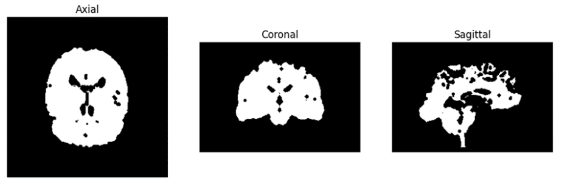
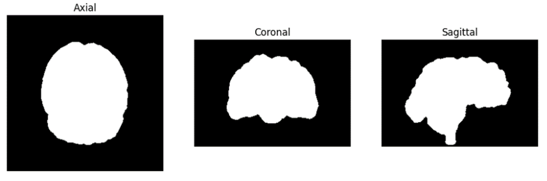
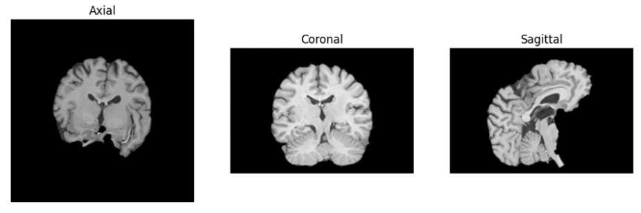
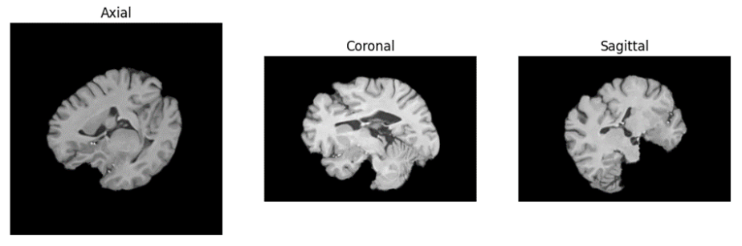
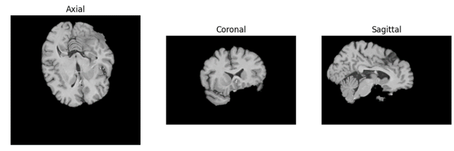

***Solution is now available! Download the full solution from here:*** [Solution](../downloads/sol_material-9.zip){ .md-button .md-button--primary .inline-button }

## Loading and 3D image and ortho view visualization
**Exercise 1**: Load the ImgT1.nii image and visualize its three ortho-views in one plot being the axial, sagittal, and coronal views

```py
dir_in = 'data/'
vol_sitk = sitk.ReadImage(dir_in + 'ImgT1.nii')

# Display the volume
imshow_orthogonal_view(vol_sitk, title='T1.nii')
```

<!-- START_SOLUTION 1 -->
??? tip "Solution 1"
    ```py

    import numpy 
    print(np.zeros(1337,1337).shape) #example solution
    ```
<!-- END_SOLUTION 1 -->

## Apply an affine transformation

**Exercise 2**: Write a function ```rotation_matrix(pitch, roll, yaw)``` which returns the rotation matrix for a given a roll, pitch, yaw. Make a 4x4 affine matrix with a pitch of 25 degrees.

<!-- START_SOLUTION 2 -->
??? tip "Solution 2"
    ```py

    import numpy 
    print(np.zeros(2337,2337).shape) #example solution
    ```
<!-- END_SOLUTION 2 -->

**Exercise 3**: Apply the rotation to the ImgT1.nii around the central point of the volume and save the rotated images as ImgT1_A.nii. Note that the central point is given in physical units (mm) in the World Coordinate System. 

??? EXAMPLE "Code Template - Exercise 3"
    You can use the next block of code:
    ```python
    # Define the roll rotation in radians
    angle = 25  # degrees
    pitch_radians = np.deg2rad(angle)

    # Create the Affine transform and set the rotation
    transform = sitk.AffineTransform(3)

    centre_image = np.array(vol_sitk.GetSize()) / 2 - 0.5 # Image Coordinate System
    centre_world = vol_sitk.TransformContinuousIndexToPhysicalPoint(centre_image) # World Coordinate System
    rot_matrix = rotation_matrix(pitch_radians, 0, 0)[:3, :3] # SimpleITK inputs the rotation and the translation separately

    transform.SetCenter(centre_world) # Set the rotation centre
    transform.SetMatrix(rot_matrix.T.flatten())

    # Apply the transformation to the image
    ImgT1_A = sitk.Resample(vol_sitk, transform)

    # Save the rotated image
    sitk.WriteImage(ImgT1_A, dir_in + 'ImgT1_A.nii')
    ```

An important consideration is that ITK transforms store the resampling transform/backward mapping transform (fixed to moving image). And then, internally, it applies the inverse of the transform to the moving image.
 
This means that we have to pass the inverse matrix of the one we have defined. This is because the transformation is applied to the moving image and not to the fixed image. It is important to consider when we want to apply the transformation to the fixed image.

!!! NOTE
     The inverse or the rotation matrix is the same as the transpose of the rotation matrix. Then, when we set the rotation matrix:
    ```transform.SetMatrix(rot_matrix.T.flatten())```

    For a more general transformation matrix (no only rotations involved), you should compute the inverse matrix:
    ```transform.SetMatrix(np.linealg.inv(rot_matrix).flatten())```

<!-- START_SOLUTION 3 -->
<!-- END_SOLUTION 3 -->

**Exercise 4**: Visualise ImgT1_A.nii in ortho view and show the rotated image.
```python
imshow_orthogonal_view(ImgT1_A, title='T1_A.nii')
overlay_slices(vol_sitk, ImgT1_A, title = 'ImgT1 (red) vs. ImgT1_A (green)')
```

<!-- START_SOLUTION 4 -->
<!-- END_SOLUTION 4 -->

## Registration of a moving image to a fixed image

??? EXAMPLE "Code Template - Registration"
    The following code is a template for the registration. You can relate it to Figure 1 in the theory note. You can modify it to your needs.

    _If the computing time is excesive, increase the shrink factor._

    ```py
    # Set the registration - Fig. 1 from the Theory Note
    R = sitk.ImageRegistrationMethod()

    # Set a one-level the pyramid scheule. [Pyramid step]
    R.SetShrinkFactorsPerLevel(shrinkFactors = [2])
    R.SetSmoothingSigmasPerLevel(smoothingSigmas=[0])
    R.SmoothingSigmasAreSpecifiedInPhysicalUnitsOn()

    # Set the interpolator [Interpolation step]
    R.SetInterpolator(sitk.sitkLinear)

    # Set the similarity metric [Metric step]
    R.SetMetricAsMeanSquares()

    # Set the sampling strategy [Sampling step]
    R.SetMetricSamplingStrategy(R.RANDOM)
    R.SetMetricSamplingPercentage(0.50)

    # Set the optimizer [Optimization step]
    R.SetOptimizerAsPowell(stepLength=0.1, numberOfIterations=25)

    # Initialize the transformation type to rigid 
    initTransform = sitk.Euler3DTransform()
    R.SetInitialTransform(initTransform, inPlace=False)

    # Some extra functions to keep track to the optimization process 
    # R.AddCommand(sitk.sitkIterationEvent, lambda: command_iteration(R)) # Print the iteration number and metric value
    R.AddCommand(sitk.sitkStartEvent, start_plot) # Plot the similarity metric values across iterations
    R.AddCommand(sitk.sitkEndEvent, end_plot)
    R.AddCommand(sitk.sitkMultiResolutionIterationEvent, update_multires_iterations) 
    R.AddCommand(sitk.sitkIterationEvent, lambda: plot_values(R))

    # Estimate the registration transformation [metric, optimizer, transform]
    tform_reg = R.Execute(fixed_image, moving_image)

    # Apply the estimated transformation to the moving image
    ImgT1_B = sitk.Resample(moving_image, tform_reg)

    # Save 
    sitk.WriteImage(ImgT1_B, dir_in + 'ImgT1_B.nii')
    ```

**Exercise 5**: Find the geometrical transformation of the moving image to the fixed image. The moving image is `ImgT1_A.nii` and the fixed image is `ImgT1.nii`. The new rotated image is named `ImgT1_B.nii` and the optimal affine transformation matrix text file is named `A1.txt`. You can try to modify the metric and optimizer step length.

<!-- START_SOLUTION 5 -->
<!-- END_SOLUTION 5 -->

**Exercise 6**: Show the ortho-view of the ImgT1_B.nii. Display the optimal affine matrix found. Does it agree with the expected and what is expected? Why? 

??? EXAMPLE "Code Template - Exercise 6"
    You can use the following snippets of code:

    You can get the estimated transformation using the following code:
    ```python
    estimated_tform = tform_reg.GetNthTransform(0).GetMatrix() # Transform matrix
    estimated_translation = tform_reg.GetNthTransform(0).GetTranslation() # Translation vector
    params = tform_reg.GetParameters() # Parameters (Rx, Ry, Rz, Tx, Ty, Tz)
    ```

    You can also convert the transformation to a homogeneous matrix using the following code:
    ```
    def homogeneous_matrix_from_transform(transform):
        """Convert a SimpleITK transform to a homogeneous matrix."""
        matrix = np.zeros((4, 4))
        matrix[:3, :3] = np.reshape(np.array(transform.GetMatrix()), (3, 3))
        matrix[:3, 3] = transform.GetTranslation()
        matrix[3, 3] = 1
        return matrix

    matrix_estimated = homogeneous_matrix_from_transform(tform_reg.GetNthTransform(0))
    matrix_applied = homogeneous_matrix_from_transform(transform)
    ```

    And store and load the transformation matrix using the following code:
    ```python
    tform_reg.WriteTransform(dir_in + 'A1.tfm')
    tform_loaded = sitk.ReadTransform(dir_in + 'A1.tfm')
    ```

<!-- START_SOLUTION 6 -->
<!-- END_SOLUTION 6 -->

**Exercise 7**: By default, SimpleITK uses the fixed image’s origin as the rotation center. Change the rotation center to the center of the fixed image and repeat the registration. Compare the results.

??? INFO
    Change the rotation center to the center of the image using the following code and repeating the registration (Exercise 5):

    ```python
    initTransform = sitk.CenteredTransformInitializer(fixed_image, moving_image, sitk.Euler3DTransform(), sitk.CenteredTransformInitializerFilter.GEOMETRY)
    ```

<!-- START_SOLUTION 7 -->
<!-- END_SOLUTION 7 -->

## Generate a series of rotated 3D images 

**Exercise 8**: Make four rotation matrices that rotate the ImgT1nii in steps of 60 degrees starting from 60 degrees. 
Apply the rotation to ImgT1.nii, reslice and store the resulting images as ImgT1_60.nii, ImgT1_120.nii etc. 
Show in ortho-view that the rotations are applied as expected for each new image.

<!-- START_SOLUTION 8 -->
<!-- END_SOLUTION 8 -->

**Exercise 9**: Use ImgT1_120.nii as the fixed image, and the other three rotated images from Exercise 8 as the moving images. Run the registration to find the affine matrix and include the reslicing procedure for each of the moving images. Show in ortho-view the resliced images and describe what the rotation angles are. Save the transforms with the name "Ex9_60.tfm, Ex10_180.tfm, Ex10_240.tfm" Do the rotations agree with those in Exercise 8?

!!! NOTE
    You will need to change the step length to handle the larger rotations. A too small step would lead to the convergence in a local minimum. A good value may be 10. You may also benefit from modifying the pyramid schedule.

<!-- START_SOLUTION 9 -->
<!-- END_SOLUTION 9 -->

## Combining a series of affine matrices

Often, we wish to combine affine matrixes from a series of images with different registration but apply reslicing only once. The reason is that every time applying reslicing it introduces blurring, and if the image is registered and resliced at each step in a series of rotations, the final image will become very affected by blurring. This we can avoid by first finding the transformation matrix per registration step, then combining them into one matrix, and then applying the reslicing as the final step to the combined affine transformation.

**Exercise 10**: Use the ImgT1_240.nii as the fixed image and use the ImgT1.nii as the moving image. Make an affine matrix clockwise by combining the estimated transformation and the affine matrix obtained at each rotation step in exercise 10 and apply reslicing. Show in ortho views that the ImgT1.nii after applying the combined affine matrix is registered as expected. Show the combined affine matrix and explains if it applies the expected rotation angle.

??? EXAMPLE "Code Template - Exercise 10"
    ```python
    # Load the transforms from file
    tform_60 = ...
    tform_180 = ...
    tform_240 = ...
    tform_0 = ...

    # Option A: Combine the transforms using the sitk.CompositeTransform(3) function
    # Concatenate - The last added transform is applied first
    tform_composite = sitk.CompositeTransform(3)

    tform_composite.AddTransform(tform_240.GetNthTransform(0)) 
    tform_composite.AddTransform(tform_180.GetNthTransform(0))
    tform_composite.AddTransform(tform_60.GetNthTransform(0))
    tform_composite.AddTransform(tform_0.GetNthTransform(0))
    # Transform the composite transform to an affine transform
    affine_composite = composite2affine(tform_composite, centre_world)

    # Option B: Combine the transforms manually through multiplication of the homogeneous matrices
    A = np.eye(4)
    for i in range(tform_composite.GetNumberOfTransforms()-1,-1,-1):
        tform = tform_composite.GetNthTransform(i)
        A_curr = homogeneous_matrix_from_transform(tform)
        A = np.dot(A_curr, A)

    tform = sitk.Euler3DTransform()
    tform.SetMatrix(A[:3,:3].flatten())
    tform.SetTranslation(A[:3,3])
    tform.SetCenter(centre_world)
    ```

<!-- START_SOLUTION 10 -->
<!-- END_SOLUTION 10 -->

## Robustness in the registration and number of iterations

If the moving image becomes too noisy the registration becomes unstable due to the appealingly many local minima in the cost function - in other words, there exist many sub-optimal solutions to the “optimal” affine matrix. In this case, the registration will be very sensitive to the selection of the hyperparameters such as the step length and the number of iterations. Moreover, depending on the optimizer the estimated affine matrix may be very unstable and will change significantly if we repeat the registration at the same noise level (This is not a critical issue for the Powell optimizer in this problem).
 
We can increase the noise level in an image by setting the noise standard deviation say to sigma = 200. We use a normal distributed random generator to generate the noise which is added to the image.

```python
moving_image_noisy = sitk.AdditiveGaussianNoise(moving_image, mean=0, standardDeviation=200)
imshow_orthogonal_view(moving_image_noisy, title='Moving image with noise')
```

**Exercise 11**: Use the ImgT1.nii as the fixed image and ImgT1_240.nii as the moving image. Increase the noise level of the moving image and register it to the fixed image and repeat the registration at the same noise-level for different step length. For what standard deviation level and step length does the optimization algorithm cannot find the global minimum? Show the ortho-views of the noisy moving image. 

??? NOTE
    When the noise is added, the optimizer becomes more sensitive to the step length. We suggest to try, at least, standardDeviation=200, and step lengths = [10, 50, 150, 200].

<!-- START_SOLUTION 11 -->
<!-- END_SOLUTION 11 -->

By using the pyramidal multi-resolution registration strategy, we can make the registration of the noisy moving image to the fixed image more robust. Here we use the Gaussian pyramid procedure where we keep the image resolution (i.e., the shrink factor) in the different steps of the pyramid but introduce blurring by using a Gaussian filter at different levels. At the highest level most blurring is added, and we only see the coarse details in the image to be registered. Then, we go to finer and finer levels of details by reducing the blurring factor. The pyramidal procedure is implemented in the registration function and typically three levels are used and we just set `sigma = [3.0, 1.0, 0.0]`. 

```python
R.SetShrinkFactorsPerLevel(shrinkFactors = [2,2,2])
R.SetSmoothingSigmasPerLevel(smoothingSigmas=[3,1,0])
R.SmoothingSigmasAreSpecifiedInPhysicalUnitsOn()
```

**Exercise 12:** Register the noisy moving image using the pyramidal procedure. Try three levels of setting sigma=[3.0, 1.0, 0.0]. Repeat the registration procedure with different step lengths. Does the image registration become more insensitive to the step length? If not try increasing sigma=[5.0, 1.0, 0.0]. Can one use only 2 levels of the pyramid? What do you suggest of sigma values? **Show the optimal affine matrices for each of the repeats to check robustness.**

<!-- START_SOLUTION 12 -->
<!-- END_SOLUTION 12 -->


## Exam preparation 
Below are some example exam exercises related to this weeks material. Work with them, and if you have issues or questions, please ask the TAs, as you will not be able to get help after the last exercise round.


You have developed a novel deep learning algorithm for performing 3D image registration. For testing purposes, you want to design some test cases to evaluate the performance of your algorithm. 

You will use a 3D MRI image of a brain (T1_brain_template.nii.gz). 

To inspect the results, you use the ortho view that shows the brain in three planes: The axial view shows the x-y plane, the coronal views the x-z plan, and the sagittal view shows the y-z plan of the brain (for example the imshow_orthogonal_view from the advanced registration exercise). 

You apply a rigid registration to “T1_brain_template” to generate your first test. The rigid transform is composed of a rotation with a yaw of 10 degrees followed by a pitch of -30 degrees. The output will be the moving image for your tests. 

You also generate a mask by applying Otsu thresholding on the template volume. Then, apply a morphological closing with a skimage.morphology.ball as a structuring element with radius 5. Finally, apply erosion with a ball with a radius of 3.

The mask is applied to both the moving and template images. Compute the intensity based normalized correlation coefficient between the two (Equation 2.6 in Elastix notes).

??? TIP "Tip:" 
    For doing the exercise, you may need to work with numpy arrays. You can extract the numpy array from a SimpleITK object using the function sitk.GetArrayFromImage(…). If needed, you can make a SimpleITK object from the numpy array with the function sitk.GetImageFromArray(…).


*Exam question 1: How does the binary mask look like?* 

- [ ] Figure 1: 
- [ ] Figure 2: 
- [ ] Figure 3: 


<!-- START_SOLUTION 13 -->
<!-- END_SOLUTION 13 -->

*Exam question 2: What is the normalized correlation coefficient between the moving and the template image when masked with the binary mask?*

- [ ] Between 0.35 and 0.45
- [ ] Between 0.15 and 0.25
- [ ] Do not know
- [ ] Between 0.45 and 0.55
- [ ] Between 0.0 and 0.15
- [ ] Between 0.25 and 0.35

<!-- START_SOLUTION 14 -->
<!-- END_SOLUTION 14 -->

*Exam question 3: How does the moving image look like after the two-step rigid transformation?*

- [ ] Figure 1: 
- [ ] Figure 2: 
- [ ] Figure 3: 

<!-- START_SOLUTION 15 -->
<!-- END_SOLUTION 15 -->