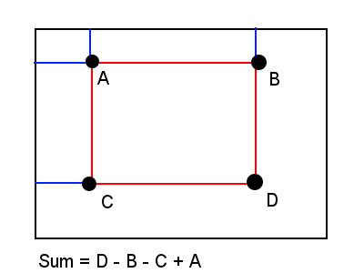
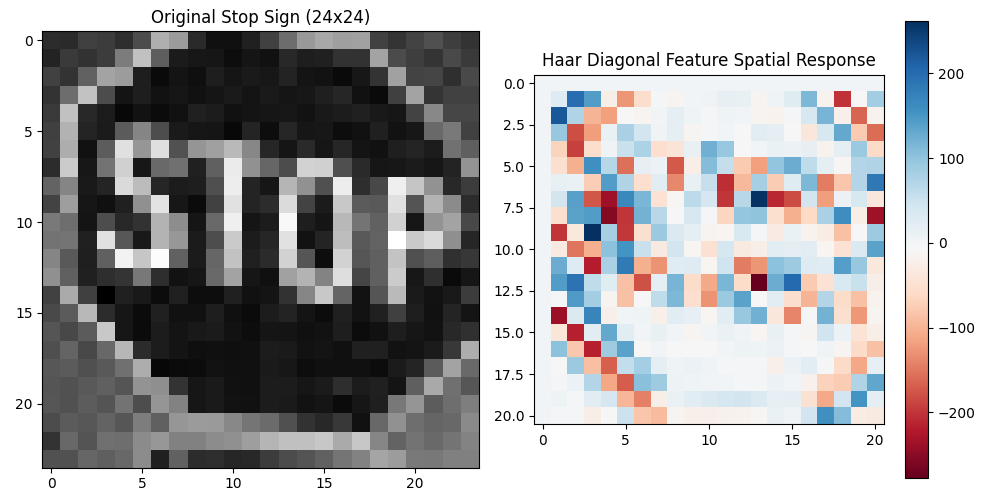
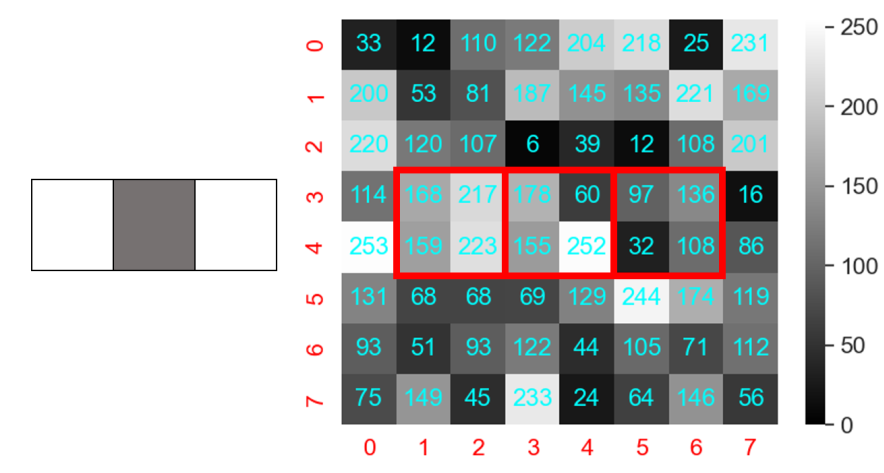
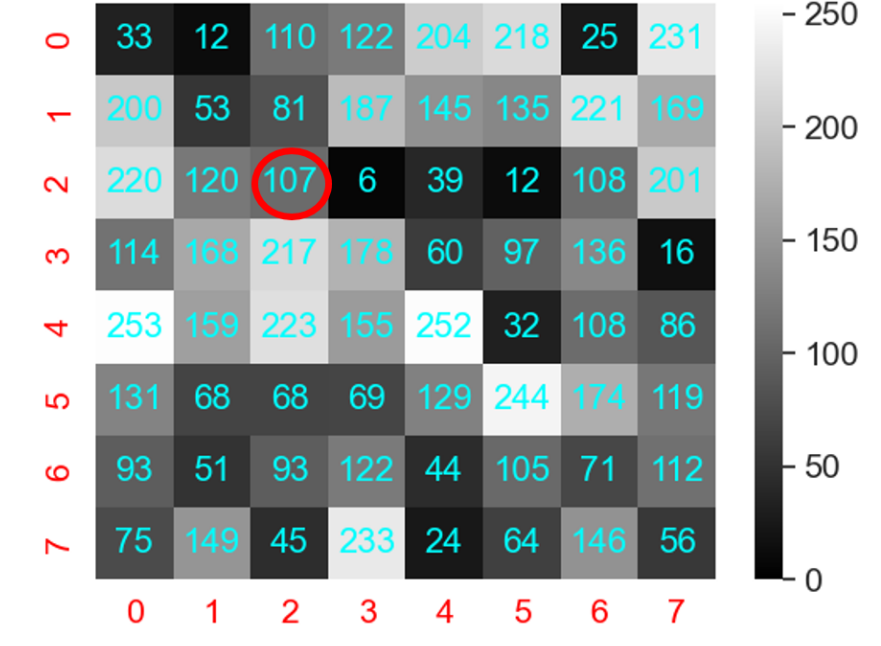

# Real Time Object Detection Using Viola Jones Method


## Part 1: Cascade Classifier used for object detection

In the following exercises, we'll investigate the performance of the Viola-Jones algorithm when trained to detect other classes. To do this, we've trained a simple stop-sign object detector for you, which we'll use in the following exercises. Later on, you'll be able to train such a model yourselves (optional). We'll show, that the framework doesn't necessarily need to be used for faces, but that it is instead a general object detection tool which can be trained to solve many object detection tasks.


We'll start by employing a pretrained stop-sign object detector for image capture. To do this, we'll use the script **VJ_performance_eval.py** in the ***data*** directory. You can find all the scripts and data we'll need [here](https://github.com/DTUImageAnalysisOrg/DTUImageAnalysis/tree/main/exercises/ex10-Viola-Jones/data). Download the folder and `cd` into it.


### Exercise 1: Testing stop-sign model performance
We'll first investigate how the trained model performs on a simple image of a stop sign. 

In the **data** folder, the image *stop_sign.jpg* can be found. 

First, try to visualize the image. 

We've provided a script to evaluate the model performance called *VJ_performance_eval.py*. It is located in the ***data***-folder. 
The script is implemented such that it must be run from the terminal, and it needs to be run with some command line arguments. If you're unsure about how to run it, [look here](../../ex1-setup/running_python_terminal). 

We may evaluate the model performance qualitatively using the *VJ_performance_eval.py* script. You run it by opening a CLI in your exercise-root (the directory which contains ***data/*** as a sub-directory) and issuing the following command:

```
python data/VJ_performance_eval.py --model data/stop_sign_detector.xml --input data/stop_sign.jpg --type image --w 24 --h 24
```

**Question 1**: *Does the model perform as expected?*

**Question 2**: *Inspect the script contents and check how the model configures its bounding box shape. Now try to print the values. Specify the top left and bottom right points of the bounding box frame.*


<!-- START_SOLUTION 1 -->
<!-- END_SOLUTION 1 -->


### Exercise 2: Visual inspection of Haar features
In order to understand the underlying decision logic that the model makes during execution, we'll take a closer look at the computed Haar features that the model accepts during evaluation. As a result, we have visualized the Haar features for a single $24\times 24$ crop of *stop_sign.jpg*. Refer to the directory **haar_features** to get insights into what the model has learned to put attention towards at different stages when given the sample image as input.

**Question 3**: *Looking at some of the computed haar features, can you deduce which features the model attends to at the different classification stages?*

!!! NOTE "Interpretation hint"
    Each feature in the figures is a spatial filter. The earlier features are "coarse", acting as an initial filter to discard "definitely negative" samples, but accepting many false positives. The filter location in the image is where in the window the feature has been fitted for evaluation. The window is then slided across the complete image frame; as a result, some of the images may have a filter location which is not a good match with the specific image. Therefore, the sizes are more easily interpreted than the specific location. Whites indicate "sum these intensities", whereas blacks indicate "subtract these pixel intensities". 

??? Tip "Hint:"
    It helps thinking about which edge orientations or patterns the features will produce high or low values for. As an example, stage 0 features seem closely related to a specific part within the stop-sign. Which? And how about the features coming right after?

<!-- START_SOLUTION 2 -->
<!-- END_SOLUTION 2 -->


### Exercise 3: Video stream object detection
Now we'd like to look at the performance of the stop sign detector when tasked with a moving image, to see whether it is robust to real-time image changes, such as object scaling and pose adjustments. Again run the file *VJ_performance_eval.py*, now using the videos **van_video.mp4** and **scale_diff.mp4** as image capture input. Remember to change the type of input to video format when issuing the command in the terminal, e.g.:


```
python data/VJ_performance_eval.py --model data/stop_sign_detector.xml --input data/van_video.mp4 --type video --w 24 --h 24
```

**Question 4**: *How does the model perform? When does it correctly detect or not detect the stop sign?*

During detection, the model computes features based on a series of scaled image sizes, forming a pyramid of images. OpenCV allows us to modify this pyramid through their detection framework.

**Question 5**: *Examine the script file and try to modify the scale_factor parameter of the detection function. Explain the effects of increasing and decreasing the scale factor (accuracy vs. frames per second). Try and see if you can find a scale-factor for which the stop sign is detected at all distances while it is completely contained in the frame.*

<!-- START_SOLUTION 3 -->
<!-- END_SOLUTION 3 -->


## Part 2: Haar feature diagnostics 
---
Viola-Jones is based on Haar features. Each stage of the decision tree evaluates one or multiple Haar features, and applies a threshold for "continuing" the cascade. 
We'd now like to take a deeper look at what a Viola-Jones style model actually bases decisions on in relation to an image window. In the **haar_features**-directory in data you are provided with 5 classifier stages, each showcasing 3 or 2 Haar features used in the specific stage. 


### Exercise 4: Loading and cropping images (Optional)
We will have a look at the last Haar feature provided in **stage_3.png**. The background image is **annotation_img.jpg**, and each square in the feature has sidelength 2. 

!!! NOTE 
    Visualization of the cascade classifiers/Haar regions was made using OpenCV2's CLI tool *opencv_visualisation*. This tool has some limitations, namely, the input image has to be of shape $(w_{window}, h_{window})$, yet the output image is upscaled x10. Upscaling adds some artifacts to the image (e.g. a decrease in contrast). Our attention will therefore be on the reference image only.

Your task is: 
1. Load the two images, both as grayscale ubyte images
2. Crop the feature image such that we only see the last feature of stage 3
3. Identify the pixel indices where the Haar feature is located in the feature image 
4. we now want to slice our *reference* image such, that we only include the pixels that are contained within the chosen haar feature and the 1-pixel border. Find the pixel coordinates and slice the reference image accordingly. In other words, we want to know the coordinate correspondents in the $24\times24$ image and visualize the crop of that exact region, including its one pixel boundary.

??? TIP "Hint:"
    Hint: Histograms could be a valuable asset for identifying pixel coordinates. 

??? TIP "Code template if you are stuck: "
    ```py 
    feat_dir = 'data/haar_features'
    img_path = os.path.join(feat_dir, 'stage_3.png')
    stage_img = io.imread(img_path)
    ref_path = 'data/annotation_img.jpg'
    ref_img = io.imread(ref_path)
    ref_img = img_as_ubyte(rgb2gray(ref_img)) # Want the image to be grayscaled
    w_enlargened, h_enlargened = (stage_img.shape[0],stage_img.shape[0])
    ROI_feat = 2
    ROI_img = stage_img[:, ?*w_enlargened:(?+1)*w_enlargened]

    ys, xs = np.where((ROI_img == ...) | (ROI_img == ...))
    coords = np.vstack((..., ...)) 

    # Get (y0,x0) and (y1,x1), slice and show image
    ymin, xmin, ymax, xmax = np.concatenate((coords.min(axis=1), coords.max(axis=1)))

    #now convert back to reference image by taking scale into account
    y_min_ref, y_max_ref = ymin//?,ymax//?
    x_min_ref, x_max_ref = xmin//?,xmax//?
    print(y_min_ref, y_max_ref, x_min_ref, x_max_ref)
    sliced_img = ref_img[y_min_ref-1:y_max_ref+2,x_min_ref-1:x_max_ref+2]
    ```

<!-- START_SOLUTION 4 -->
<!-- END_SOLUTION 4 -->


### Exercise 5: Compute the integral image of image slice
Having found the ROI, compute the integral image over the reference image slice. Visualize the integral image along with the original reference image slice.


??? TIP "If you skipped the last exercise"
    You can find the crop we need using 
    ```py
    sliced_img = ref_img[14-1:17+2,4-1:7+2]
    ```

!!! INFO
    *It is important that the boundary of your integral image goes beyond the ROI by at least 1 pixel in all directions. cv2.integral fixes this for you by zero-padding the upper and left boundary, but keep this in mind when using numpy.cumsum - that is the reason we included the 1-pixel boundary*

??? TIP "Hint:" 
    The functions numpy.cumsum or cv2.integral may be of use, but you could also implement it exactly as done in the VJ paper.

<!-- START_SOLUTION 5 -->
<!-- END_SOLUTION 5 -->

### Exercise 6: Compute the Haar feature
Now, compute your Haar feature. To do so, extract the haar corners of each Haar region and compute their individual Haar sum. Finally, compute:

$$H = [\text{Sum of regions with white pixels}] - [\text{Sum of regions with black pixels}]$$

To retrieve the Haar feature. The following figure might become of use:



Figure copied from [Wikipedia](https://en.wikipedia.org/wiki/Summed-area_table).

??? TIP "Hint:"
    You can make a function for evaluating a rectangle in an integral image based on its corner coordinates, a function for computing a diagonal type feature and a function for indexing start and stop values

<!-- START_SOLUTION 6 -->
<!-- END_SOLUTION 6 -->

### Exercise 7: Trying to relate a Haar feature to a single scale class instance 
Haar feature responses are used for training many weak classifiers in Viola-Jones style classification. Each stage compares the feature response to a threshold value. Therefore, larger feature responses (measured per absolute value) will in general have a larger tendency to play a role in the threshold decision. Therefore, it is informative to understand which sorts of image features produce a high and low values of the filter in order to gain an understanding of which image features may play a large role in the decision cascade. We have evaluated the same diagonal stage 3 Haar filter across the complete image **annotation_img.jpg** by sliding it spatially. While this is not what happens in the Haar cascade, it allows us to understand which image features are positive/negative at this exact scale. 

The output is shown below: 



Looking at the image, which image features translate to high vs. low values in the filter response? In which regions is the filter zero? How is the filter behaviour different from a standard edge-detector?

??? EXAMPLE "Code for producing output"
    ```py 
    import matplotlib.pyplot as plt
    ref_path = 'annotation_img.jpg'
    ref_img = io.imread(ref_path)
    ref_img = img_as_ubyte(rgb2gray(ref_img)) # Want the image to be grayscaled
    integral_img = cv2.integral(ref_img)[1:,1:]


    # Parameters for diagonal Haar (Total size 4x4)
    w_reg, h_reg = 2, 2 
    img_h, img_w = integral_img.shape

    # The heatmap size: 24x24 image - 4x4 feature + 1 = 22x22
    heatmap = np.zeros((img_h - 3, img_w - 3)) 

    for y in range(1, img_h - 3): # Start at 1 because compute_diagonal_feats expects y0-1
        for x in range(1, img_w - 3):
            
            # Define the start positions for the 4 internal squares 
            # based on the current top-left (y, x)
            # [Top-Left, Top-Right, Bottom-Left, Bottom-Right]
            current_starts = np.array([
                (y, x),             # Region 0 (Black)
                (y, x + w_reg),     # Region 1 (White)
                (y + h_reg, x),     # Region 2 (White)
                (y + h_reg, x + w_reg) # Region 3 (Black)
            ])
            print(current_starts)
            response = compute_diagonal_feat(integral_img, current_starts, w_reg, h_reg) #Haar response at location
            # Store in heatmap (adjusting indices for 0-based array)
            heatmap[y, x] = response

    plt.figure(figsize=(10, 5))
    plt.subplot(1, 2, 1)
    plt.title("Original Stop Sign (24x24)")
    plt.imshow(ref_img, cmap='gray')

    plt.subplot(1, 2, 2)
    plt.title("Haar Diagonal Feature Spatial Response")
    plt.imshow(heatmap, cmap='RdBu') # Red-Blue shows positive/negative peaks
    plt.colorbar()
    plt.tight_layout()
    plt.savefig("haar_feature_response.png")
    plt.show()
    ```

!!! NOTE "Interpretability in practice..."
    If you actually open the XML file for the classifier, you would find the following for this exact stage 3 feature:
    ```
    <_>
    <internalNodes>
        0 -1 8 6.9459797814488411e-03
    </internalNodes>
    <leafValues>
        -8.5354012250900269e-01 6.2478762865066528e-01
    </leafValues>
    </_>
    ``` 
    which means that the actual threshold for the decision rule is $x\geq 6.9459797814488411e-03\approx 0$. The leafValues indicate the value of $h_i(x)$ assigned based on the test (left or right), i.e. $h_i(x)=-0.854$ if $F_i<6.94e-03$. The stage-threshold for stage 3 is negative: -1.18, so in this exact case, a positive weak classifier output (right_val = +0.6248) pushes the stage score upward, increasing the chance that the window passes stage 3, and thus is not rejected.


## Part 3: Training your own object detector (**Optional**)
---
The stop-sign model was trained using data from Caltech-101, consisting of 64 training images with bounding box annotations. We'll now try to train our own object detector from the same dataset! The dataset contains 101 annotated object categories each with separate subset sizes, ranging from 40-800 images. You can download the dataset from [here](https://data.caltech.edu/records/mzrjq-6wc02). In order for everything to work as expected, you need to place the root of the Caltech-101 dataset into the **data** folder. 

In order to perform this exercise, we highly recommend using Anaconda. Training an object detector using tools provided by OpenCV requires an older version of OpenCV, which can be handled much easier using Anaconda.

### Exercise 8: Setup new virtual environment (**Optional**)
We first need to setup a new virtual environment, in order to run the tools we need, which have been disabled for newer versions of OpenCV (>3.4). To start with, if you're currently in a virtual environment, deactivate by running:

```bash
conda deactivate
```

Now we create a virtual environment with the necessary installation of OpenCV and activate it. This can be done as follows:

```bash
conda create -n obj_train python 'opencv>=3,<4' scipy scikit-image
conda activate obj_train
```

### Exercise 9: Preprocess data (**Optional**)
In order for our data to fit to the semantic notation needed for the OpenCV training tools, we first need to perform some pre-processing on our annotations. To do so, you need to choose **1)** a *positive* class, denoting the class you want your model to identify, which allows the model to learn relevant features; and **2)** a *negative* class, which is intended to teach the model relevant rejection features. In the case of the stop-sign model, the chosen positive class was *stop_sign* and the negative class was *car_side*.

Run the following command when at the root of the **process_dataset.py** script:

```bash
python process_dataset.py --pos <pos_class> --neg <neg_class>
```

With *pos_class* and *neg_class* being the explicit names of the categories in the Caltech-101 dataset (they must be present in the Annotations directory)

!!! TIP On which classes to choose 
    As the dataset is fairly small, please choose a positive class and negative class which are fairly different. 

Having run this script, the data files *pos_class_pos.dat* and *pos_class_neg.dat* should be contained in the Caltech-101 folder along with their gray-scaled datasets in the folders **pos_class_gray** and **neg_class_gray**.

### Exercise 10: Train object detector (**Optional**)
Now we'll commence the training portion of the exercise! To start with, *cd* into the Caltech-101 folder, as the following OpenCV tools only work from the folder where the data resides. We first need to create positive samples, which define what the model should look for when trying to find the object of interest. This will be handled by the OpenCV create_samples CLI tool, which creates a *positive vector file* holding the positive samples. This can be done as follows:

```bash
opencv_createsamples -info <pos_class>_pos.dat -vec positive.vec -w <width> -h <height>
```

!!! NOTE
    You may need to set an optional flag *-num N*, where N is the number of samples to generate. By default 1000 samples are created, however, if the number of bounding boxes in your dataset exeeds this amount, then you'll be prompted by an error.


Where the *-w* and *-h* parameters specify the width and height respectfully for the window size. You can just set them as 24 for now. From this, the file *positive.vec* should exist in your current working directory.

We may now start training our model. To do so, first make a directory to append the output files to. Run the following commands:
```bash
mkdir my_detector
opencv_traincascade -data my_detector -vec positive.vec -bg  <pos_class>_neg.dat -numPos <N> -numNeg <M> -numStages <S> -w <width> -h <height>
```

Here, the width and height arguments are the same that you used in the last command execution. M should be set as the number of negative samples available. 

!!! NOTE 
    If you are training the stop-sign detector, we recommend to use the following setup for training
    ```opencv_traincascade -data my_stop_sign_detector -vec positive.vec -bg  stop_sign_neg.dat -numPos 58  -numNeg 64 -numStages 18 -w 24 -h 24```


!!! NOTE 
    The -numPos parameter should be set to roughly 80-90% of the total samples in your .vec file. This creates a 'buffer' of extra images. During training, each stage must satisfy a minHitRate (default 0.995). If a specific positive sample is too 'hard' to be correctly classified by the current features while maintaining that rate, the trainer discards it and pulls a 'fresh' sample from the remaining buffer in the .vec file. If -numPos is set to the absolute maximum, the trainer has no flexibility; it must classify every single image perfectly, which often leads to the training 'crashing' or terminating prematurely when it hits a difficult sample.

For added context and potential extensions of the above, please refer to the documentation of the OpenCV tools *opencv_createsamples* and *opencv_traincascade* [here](https://gregorkovalcik.github.io/opencv_contrib/tutorial_traincascade.html).

After running the above, you should have a working Viola Jones object detection model! The model is named *cascade.xml* and is located in the folder **my_detector**.

Now, you're able to evaluate the performance of your own detector! Try to retrieve some images and videos from e.g. [Google.com](https://www.google.com/) or [Pexels.com](https://www.pexels.com/) and run the model evaluation script to see if it performs up to standard, or whether extra data is necessary to make a better model. Note that the image should be RGB. 

1. change your path to the ***data*** folder
2. Run: `python data/VJ_performance_eval.py --model <path/to/my_detector/cascade.xml> --input <path/to/your_image.jpg> --type image --w <width> --h <height>`


!!! INFO
    *If you want to visualize cascade classifiers on your own image annotation, look at the documentation of the beforementioned function [here](https://docs.opencv.org/3.4/dc/d88/tutorial_traincascade.html).*


## Part 4: Applied Viola-Jones on webcam stream 

Now that we've familiarized ourselves with the underlying workings of the Viola-Jones method, the remaining exercises intend to showcase how the algorithm can be applied in practice. To do so, we will employ some pretrained cascade classifiers, which can be found [here](https://github.com/opencv/opencv/tree/master/data/haarcascades). For the exercises, we'll need the classifiers:

- _haarcascade_frontalface_default.xml_ 
- _haarcascade_eye.xml_
- _haarcascade_eye_tree_eyeglasses.xml_

Save them somewhere where you can easily define the path for loading, e.g. in a folder called **pretrained_classifiers**.

In this first part, you'll familiarize yourself with the tools you'll use in [Part 5](#part-5-snapchat-like-object-filters), where you'll create your own _Snapchat_ like filter!

??? NOTE "Automatic download for Mac and linux users"
    In the exercise [data/](../../downloads/material-10.zip) folder, there is a script you can use to download all the classifiers called download_classifiers.sh. 
    To do so, do the following two steps in a terminal with your root as the exercise root: 
    ```
    cd your_exercise_10_root 
    chmod +x data/download_classifiers.sh
    ./data/download_classifiers.sh
    ```

    If you experience any issues, simply download them manually. 

!!! WARNING "Warning: Lack of model detections"
    For the exercises in [Part 4](#part-4-warming-up-and-gaining-familiarity) and [Part 5](#part-5-snapchat-like-object-filters), you are encouraged to use your webcam. As the classifier models are highly susceptible to poor lighting conditions, e.g. produced by directional lighting, it might be difficult for it to detect eyes and faces.

    If this is the case, in order for you to still be able to go through with the exercises, you have two options:

    1. Relocate to somewhere with better lighting (brighter and/or diffused lighting),
    2. Instead of using your webcam, you may use a video instead. For this, we've provided a video _speech_snippet.mp4_ at the root of the [exercise data](../../downloads/material-10.zip). Set the videopath as value of the `VIDEO_FILE` variable.

### Exercise 11: using a pretrained classifier on web-cam feed 
Start out by opening the file *part_1_viola_jones.py*. Change the variable `pretrained_dir` such that it points to your pretrained classifiers and gain a quick overview of the script.

??? EXAMPLE "Code Template for exercises 11-13"
    The contents of the file part_one_viola_jones.py are roughly: *

    ```python
    from __future__ import print_function
    from typing import Tuple
    import time
    import cv2

    """
    An adapted version of https://docs.opencv.org/3.4/db/d28/tutorial_cascade_classifier.html
    """

    def connect_camera(use_droid_cam: bool = False) -> cv2.VideoCapture:
        Attempts to connect to the webcam. 
        """
        If this fails, prints an error message and exits the complete script. 

        Args:
            use_droid_cam (bool, optional): whether to use the android camera, as done in video change detection exercises, ex2b. Defaults to False.

        Returns:
            cv2.VideoCapture: the opencv camera object which we can pull frames from
        """
        print("Opening connection to camera")
        url = 0
        use_droid_cam = False
        if use_droid_cam:
            url = "http://192.168.1.120:4747/video"
        cap = cv2.VideoCapture(url)
        if not cap.isOpened():
            print("Cannot open camera")
            exit()

        ret, _ = cap.read()
        if not ret:
            print("---(!)Error reading frame from webcam")
            exit()
        print("Successfully connected to camera capturing device")
        return cap 

    def load_cascades(cascade_directory: str) -> Tuple[cv2.CascadeClassifier, cv2.CascadeClassifier]:
        """
        A function to load a the pretrained opencv cascade detectors (Viola-Jones-type)
        Remember to download the classifiers beforehand (https://raw.githubusercontent.com/opencv/opencv/3.4/data/haarcascades/)

        Args:
            cascade_directory (str): the directory the classifier .xml files are in

        Returns:
            tuple[cv2.CascadeClassifier]: a tuple of the two classifiers
        
        """
        face_cascade = cv2.CascadeClassifier() #initialize a classifier instance
        eyes_cascade = cv2.CascadeClassifier()
        
        face_cascade_name = cascade_directory + "/haarcascade_frontalface_default.xml"
        eyes_cascade_name = cascade_directory + "/haarcascade_eye.xml" #specify which classifiers to load
        
        
        if not face_cascade.load(cv2.samples.findFile(face_cascade_name)):
            print('--(!)Error loading face cascade')
            exit(0)
        if not eyes_cascade.load(cv2.samples.findFile(eyes_cascade_name)):
            print('--(!)Error loading eyes cascade')
            exit(0)

        print("Loaded cascade classifiers")
        return face_cascade, eyes_cascade


    if __name__=="__main__":
        ###step 1: connect to webcam
        USE_DROID_CAM = False 
        cap = connect_camera(USE_DROID_CAM)
        
        ###step 2: load classifiers, remember to download them beforehand 
        pretrained_dir = "data/pretrained_classifiers"
        face_cascade, eyes_cascade = load_cascades(pretrained_dir)
        
        # To keep track of frames per second
        start_time = time.time()
        font = cv2.FONT_HERSHEY_COMPLEX
        n_frames = 0

        #make the loop
        stop = False

        while not stop:
            ret, frame = cap.read() #read rgb frame
            if frame is None:
                print('--(!) No captured frame -- Break!')
                break
        
            frame_gray = cv2.cvtColor(frame, cv2.COLOR_BGR2GRAY) #convert to grayscale
            frame_gray = cv2.equalizeHist(frame_gray) #see pp 42-44 in MIA book. Necessary because the pre-trained classifiers were trained on this
            

            faces = face_cascade.detectMultiScale(frame_gray) #face detection
            for (x,y,w,h) in faces:
                center = (x + w//2, y + h//2)
                frame = cv2.ellipse(frame, center, (w//2, h//2), 0, 0, 360, (255, 0, 255), 4)
                faceROI = frame_gray[y:y+h,x:x+w]
                eyes = eyes_cascade.detectMultiScale(faceROI) #constrain eye-detection to be within the face region
                for (x2,y2,w2,h2) in eyes:
                    eye_center = (x + x2 + w2//2, y + y2 + h2//2)
                    radius = int(round((w2 + h2)*0.25))
                    frame = cv2.circle(frame, eye_center, radius, (255, 0, 0 ), 4)
            
            # Keep track of frames-per-second (FPS)
            n_frames = n_frames + 1
            elapsed_time = time.time() - start_time
            fps = int(n_frames / elapsed_time)

            """
            exercise 2) count the number of detected faces and eyes
            """
            N_faces = -1
            N_eyes = -1

            # Put the information on the image frame: FPS, number of faces, number of eyes 
            str_out = f"fps: {fps}, N_f: {N_faces}, N_e: {N_eyes}"
            cv2.putText(frame, str_out, (100, 100), font, 1, 255, 1)
            cv2.imshow('Capture - Face detection', frame)

            if cv2.waitKey(1) == ord('q'):
                stop = True
    ```

**Question 6**: *Which functions does what? Where is the detection actually happening?*

Now run the script and try moving a bit around in front of the webcam, e.g. by rotating your head, looking to the sides, and changing your distance to the screen.

**Question 7**: *When does the detection work well, and can you tell why the model has deficiencies?* 

### Exercise 12: Counting the number of detections
Implement functionality to count the number of faces and eyes detected. This should be based on the output of the `detectMultiScale` function calls, i.e. the variables faces and eyes. Print the number of eyes and faces detected into the text which already measures the frames per second. Ensure that it works correctly when multiple faces with eyes are detected.    

??? TIP "Hint:" 
    In order to figure out what the function returns, try to write print(faces) when a face is detected vs when you put a finger in front of the webcam. Is the return type consistent in the two cases?
 
??? TIP "Hint 2:"
    ***len()*** works for numpy arrays, python lists and tuples.

<!-- START_SOLUTION 12 -->
<!-- END_SOLUTION 12 -->

### Exercise 13: Decreasing false positive and false negative detections
You may notice a number of false positive detections, especially for the eye detection. Likewise, if you wear glasses, you may experience some false negatives. 
Let's try to improve upon that. There are two quick fixes we will try out:

1. Check out the `detectMultiScale()` documentation [here](https://docs.opencv.org/master/d1/de5/classcv_1_1CascadeClassifier.html). We can restrict detections to be larger than a certain size. Try to tune the size such that nostrils are no longer detected. You can also set a `maxSize`, if many detections are larger than what you expect eyes would be. Both should ideally be set adaptively based on the height and width of the face detected. 

2. Using another trained detection model. We could e.g. try the *haarcascade_eye_tree_eyeglasses.xml* model instead, which is trained to be more robust. Change the function `load_cascades` so that you use the eyeglasses-model instead and see if this improves robustness. Try comparing the quality when the `minSize` and `maxSize` arguments are set vs. not set. 

You could also implement these changes into the face detection, the quality of which also is based on lighting conditions, etc.


<!-- START_SOLUTION 11-13 -->
<!-- END_SOLUTION 11-13 -->

## Part 5: Snapchat-like object filters 

We've already seen that we can detect eyes and faces somewhat robustly. Now, we will use this knowledge to make a Snapchat-like filter, where an object is placed on an image (the webcam/video feed) on an anchor-point (e.g. the top of the head). The goal is, that the object should track the anchor-point on the head through successive frames. 

In order to achieve this, we will need to be able to load an image with either a transparent background (RGBA-image), or alternatively load an image which we can make a mask for which could achieve the same end.

### Exercise 14: loading an RGBA image
Open the file *part_2_viola_jones_snapchat.py* in the ***data/*** directory. Finish the function `load_png_object` and use it to load the hat object which has the path *image_props/hat_rescaled.png*. Pass the flag `cv2.IMREAD_UNCHANGED`, which forces _OpenCV_ to load the image using an extra alpha-channel. Return the image and the image shape. Test that the shape is as you expect.

??? FAILURE "No hat is displayed"
    In order to render the hat initially, the eye model needs to detect two eyes. After this, the hat will persistently be displayed at a dummmy position.

**Question 8**: *How can you interpret the alpha-channel?*

<!-- START_SOLUTION 14 -->
<!-- END_SOLUTION 14 -->


### Exercise 15: Eye-centre landmark registration 
For the approach we will use for visualizing the hat on top of the head, we will use a simplified landmark-based approach. In order to place the hat correctly, we will need to infer three landmarks:


1. The centre coordinate of the left eye detection;

2. The centre coordinate of the right eye detection; and

3. The centre coordinate of the top of the detected face.

For each detected face and pair of eyes, we will need to save these coordinates.

All landmarks we need to infer are defined in the following loop:

```python 
for i, (x,y,w,h) in enumerate(faces):
            center = (x + w//2, y + h//2)
            face_center = np.array([center[0],center[1]])
            frame = cv2.ellipse(frame, center, (w//2, h//2), 0, 0, 360, (255, 0, 255), 4)
            faceROI = frame_gray[y:y+h,x:x+w]
            #detect eyes
            eyes = eyes_cascade.detectMultiScale(faceROI)
            N_eyes = len(eyes)
            eye_center_holder = []
            if N_eyes==2: #only go further if we have detected two eyes.. 
                eye_coord_arr = np.zeros((2,2))
                for i, (x2,y2,w2,h2) in enumerate(eyes):
                    eye_center = (x + x2 + w2//2, y + y2 + h2//2)
                    radius = int(round((w2 + h2)*0.25))
                    frame = cv2.circle(frame, eye_center, radius, (255, 0, 0 ), 4)
                    eye_coord_arr[i,:] = np.array([eye_center[0],eye_center[1]]) #x, y in frame coordinates
```
Which can be found in the reference file.

First, we will start by detecting the left and right eye centre coordinates.
If we work from a simplified assumption that the right eye will be located to the right of the left eye, we can identify the centre coordinates based on the contents of `eye_coord_arr`. 

Your task is to finish the function `assign_eyes` which should output the left and right eye centre coordinates as numpy arrays.
<!-- START_SOLUTION 15 -->
<!-- END_SOLUTION 15 -->

### Exercise 16: Constructing a normal vector for finding the top of the face 
Having found the left and right eye centre coordinates, we now want to identify the top of the head. This can examplewise be done by finding a vector which always points upwards in the face coordinate system. This can be achieved by first finding the vector which goes from the left eye to the right eye $\vec{P}$, and followingly finding its normalized normal vector, $\vec{n}_{\vec{P}}$. 

Your task is to: 

1. Calculate the vector going from left eye to right eye, $\vec{P}$

2. Find the corresponding normal vector, $\vec{n}_{\vec{P}}$

3. Calculate the normalizing factor such that it is a unit-norm normal vector
   
The normalizing factor can be found by using `np.linalg.norm(n_vec)`.

!!! NOTE
    In some cases, the CascadeClassifier registers multiple eye instances in the same eye. In this case, the norm will be zero, and normalization will yield an error. As a result, we will in this case not proceed further with calculating the normalized normal vector.
<!-- START_SOLUTION 16 -->
<!-- END_SOLUTION 16 -->

### Exercise 17: Identifying the coordinate at the top-middle of the face
If we from the centre coordinate of the face go along the normal vector $\vec{n}_{\vec{P}}$ along the length $\frac{h}{2}$, where $h$ is the height of the face, we should reach the top coordinate of the face. This will yield our third landmark.

Calculate the end-point on the face. Ensure that the output is an integer, and if not, round it to an integer. 
You can debug your solution with: 
```python
cv2.circle(frame,(end_point_hat_x,end_point_hat_y),10, color=(0,255,0),thickness=3, lineType=8, shift=0) #blue circle - top of face 
``` 

which inserts a circle at the coordinate you've found.
<!-- START_SOLUTION 17 -->
<!-- END_SOLUTION 17 -->

### Exercise 18: Transformations!
A Snapchat filter resizes the objects such that they somewhat fit with the width of the head, so we will do the same - currently, it is way too small! Finish the function `rescale_object` such that the hat somewhat fits on the face. Use `skimage.transforms.rescale` for this. 
<!-- START_SOLUTION 18 -->
<!-- END_SOLUTION 18 -->

### Exercise 19: Place the hat on the coordinate
In order to place the hat, we need to identify which coordinate in the hat coordinate frame we wish to align with the found `end_point_hat_x` and `end_point_hat_y`. In other words, we need to find the necessary translation between the hat coordinate frame (local) and the webcam/video image coordinate frame (global). We save these coordinates in format $y,x$ in the `anchor_point` variable. 
Try defining a suitable alignment point and visualizing the results by running the script.

!!! NOTE
    The transformation is carried out in the `insert_hat_on_frame` function, where the variables `slice_start_y` and `slice_start_x`:
    ```python
    def insert_hat_on_frame(frame_rgb, obj, coords, anchor):
        # coords = where anchor should go in the rgb frame, i.e. face coordinate position
        target_y, target_x = coords
        anchor_y, anchor_x = anchor  # anchor inside the hat image

        # top-left corner on frame where hat-image should start
        slice_start_y = int(target_y - anchor_y) 
        slice_start_x = int(target_x - anchor_x)
    ```

define at which global coordinate the hat image $(0,0)$ should be located. 

??? TIP "Hint"
    A good coordinate could be the bottom-centre of the hat image.

<!-- START_SOLUTION 19 -->
<!-- END_SOLUTION 19 -->

### Exercise 20: Rotating for realism
Based on our normal-vector $\vec{n}_{\vec{P}}$, we can even calculate the corresponding angle the hat should be rotated to follow the face rotation. The angle of rotation is measured in counter-clockwise direction compared to the horizontal axis, and as such can be calculated using the normal-vector. 

Set the boolean `ROTATE` flag as `True` and implement the calculation of the rotation angle. Store the result in `theta`, and ensure it is in degrees. 
The `rotate_object` function rotates the object using the `anchor_point` as rotation centre with the `skimage.transform.rotate` function we've worked with before. Use the center bottom point of the object image as the centre coordinate, i.e.: 
```python
anchor_point = np.array([object_im_trf.shape[0]-1,object_im_trf.shape[1]//2])
```

The function outputs the position of the rotation-centre post transformation aswell. 

!!! NOTE "Rotation limitations"
    For larger rotation angles the object will become cropped. If you set the flag allow_resize=True, the rotated object image is resized such that no information is lost. This adds a layer of complexity, as we in this case need to correct for the resizing of the object as well. This is handled by the variables dy and dx. Only run it with resize=False. 

<!-- START_SOLUTION 20 -->
<!-- END_SOLUTION 20 -->

<!-- START_SOLUTION 14-20 -->
<!-- END_SOLUTION 14-20 -->

### Exercise 21: Speeding things up (**Optional**)
You might have noticed that the video feed is quite sluggish. In its current state, there are quite a few inefficiencies in the code. The largest overhead is in the image transformations, so reducing the number of times they are called or making them more efficient would improve real-time performance. 
Try to see if you can speed things up. Can you find some obvious inefficiencies? 

??? TIP "Optimization suggestions" 
    Here are a few of the more obvious suggestions for increasing performance: 
    
    ??? TIP "Suggestion 1:"
        The interpolation order for rotations and rescalings could in some cases be set to 0 with no large effect on the output. This is cheaper to compute 
    
    ??? TIP "Suggestion 2:"
        Rotating an object can be fairly expensive, especially if it is a large image. Similarly resizing is not always necessary. We could spare the transformations if we chose to only resize when the face width is significantly different to last iteration. Similarly for the rotation angle. Else we could simply use the transformed image from the last iteration. 
    
    ??? TIP "Suggestion 4:"
        While good, skimage.transform.rotate and skimage.transform.rescale are significantly slower than opencv alternatives. Try to implement some of the functionality using opencv instead.
    
    ??? TIP "Suggestion 5:"
        As we learned in the week with geometric transformations, transformations can be combined. As a result, we could combine the translation, scaling and rotation into a single rigid transformation. Of course, you would need to keep track of where the alignment centre ends up in the transformed object image
    
    ??? TIP "Suggestion 6:"
        The rotation of the anchor-point mask is currently done numerically, thus making one unecessary rotation per iteration. Could you find the coordinate analytically instead?
    
    ??? TIP "Suggestion 7:"
    	Optimizing the cascade classifier: increasing the scaleFactor will reduce the number of layers in the image pyramid, and thus yield faster evaluation speeds. Similarly, increasing the number minNeighbors will allow faster rejection of candidates. Lastly, for the face-detection, the minSize argument could preferentially be tuned to only allow larger detections, which significantly will speed up the search. 
    ??? TIP "Suggestion 8:"
    	Currently the tracker is detecting faces on the complete image for each frame, but in practice a person in front of the camera would probably be located within a neighborhood of the last detection. If we reduce the search region of interest to only be within the crop $x\pm\Delta$ and $y\pm\Delta$, we would be able to speed up the complete pipeline significantly. We could then evaluate it on the complete frame only if the face is lost.  
    
    ??? TIP "Suggestion 9:" 
    	Image downscaling: instead of evaluating the cascade classifier on the input image size, we could downscale it beforehand, e.g. by a factor 2. All detected coordinates would then simply have to be multiplied by a factor two in the shown modified image.  

    You can try any of these optimizations (there exist more than these), and see if you can measure the impact on the fps displayed. 

<!-- START_SOLUTION 21 -->
<!-- END_SOLUTION 21 -->

### Exercise 22: Increasing robustness (**Optional**)
In some lighting conditions, the hat placement is still very unrobust and eye-detection may still be faulty. Try to tune the max and min-size of face and eye detections. In addition, you could build in "memory" of earlier rotation angles `theta` and the `end_point_hat_y` and `end_point_hat_x` positions.

??? TIP "Hint"
    Consider equation 4 from the video-change-detection note. Finish the `time_smoothen_detections` function and add smoothing support. Does your result improve? 
    Consider the reason why we calculate the smoothing only on the end-points and angle, and not on the intermediary quantities.


## Part 6: Exam preparation 
Below are two example exam exercises. Work with them, and if you have issues, please ask the TAs, as you will not be able to get help after the last exercise round.

### Exercise from 02502 Image Analysis Exam Spring 2025

*Question 1: One of the following statements is not correct. Which one?*

- [ ] Do not know
- [ ] Haar features can be computed fast using an integral image.
- [ ] Procrustes alignment can be used to do groupwise registration of several point clouds
- [ ] The Hough transform can find the shortest curved path trough an image
- [ ] The Prewitt filter can be used to detect high gradients in an image
- [ ] A pixel with RGB values of [255, 255, 255] is white

<!-- START_SOLUTION 22 -->
<!-- END_SOLUTION 22 -->


### Exercise from 02502 Image Analysis Exam Fall 2022: Fast face detection
You want to create a new app that can detect faces and put funny hats on them. You are
basing your method on the well known Viola Jones face detector.



*Question 2: You need to compute many image features fast and have chosen to use the Haar features. In the image, you can see the three rectangle Haar feature and how it is placed in an image. What is the resulting feature value?*

- [ ] 116
- [ ] Do not know
- [ ] -317 
- [ ] -495
- [ ] 324
- [ ] -9

<!-- START_SOLUTION 23 -->
<!-- END_SOLUTION 23 -->




*Question 3: To be able to compute image features very fast, you pre-compute an integral image. The input image can be seen above. What is the value of the integral image at the marked pixel?*

- [ ] 109
- [ ] 516
- [ ] 936 
- [ ] 789
- [ ] Do not know
- [ ] 884

<!-- START_SOLUTION 24 -->
<!-- END_SOLUTION 24 -->


# References
---
[YOLO object detection](https://arxiv.org/abs/1506.02640)

[Comparison of Viola-Jones performance vs. YOLO v3](https://www.researchgate.net/publication/364311838_Comparative_of_Viola-Jones_and_YOLO_v3_for_Face_Detection_in_Real_time)

[Study on the strength and limitations of the Viola-Jones algorithm](https://www.researchgate.net/publication/367584143_evaluation_study_of_face_detection_by_Viola-Jones_algorithm)

[Speech at the International Union of Electrical Radio and Machine Workers](https://archive.org/details/201291_International_Union_of_Electrical_Radio_and_Machine_Workers)


    
