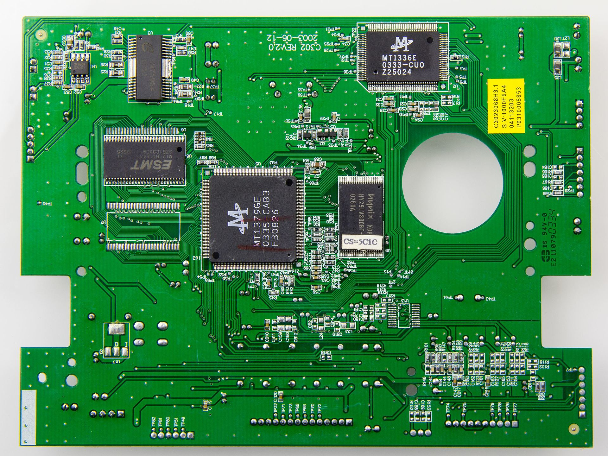
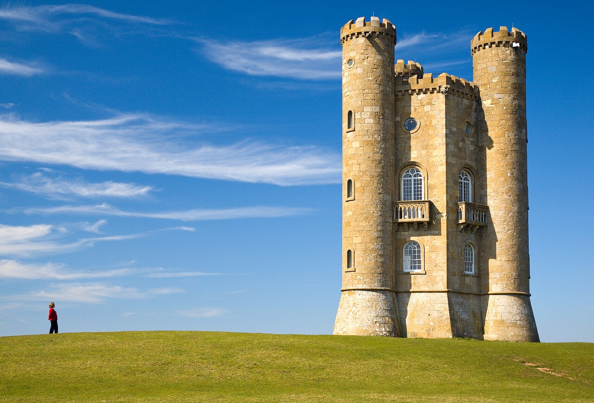

## Path tracing 

In this exercise, you will work with dynamic programming. Specifically, we will work on three images, to show-case three different use-cases for path-tracing.


## Part 1: A basic path tracing task 

### Exercise 1: Finding the accumulator image (the forward pass)
In the ***data/*** folder, you are provided with an image *fundus.png*. 
Calculate the optimal path, as described in the book, to trace the complete major vein in the image from left to right. Implement a function which returns the accumulator image $A$ and the backtracing image $T$. Remember to convert the image to grayscale before doing any path-tracing. 

??? Tip "If you are stuck:"
    You can either rotate the image in order to use the completely same approach as in the book, or instead implement a function which goes from left to right. We recommend doing it from left to right as it will work with downstream exercises.
    Start out by only making a function which carries out the algorithm from one direction. Later, you can expand on it to handle multiple directions. 
    The function only needs as an input the image and a direction. 

??? Tip "If you are still stuck:"
    Assume you go from left to right. Then you can use: 

    ```py 
    accumulator_image[:, 0] = im[:, 0]
        for col in range(1, accumulator_image.shape[1]):
                for row in range(accumulator_image.shape[0]):
                    #do something here.. and remember to take care of the image boundaries!     
    ```


<!-- START_SOLUTION 1 -->
<!-- END_SOLUTION 1 -->

### Exercise 2: Finding the minimum cost path (backtracking)
Implement a function which takes as input the accumulator image $A$ and the backtracking image $T$ and returns the minimal cost path coordinates. Implement it such that it works for finding the minimal cost path when solving the problem from left to right. 


### Exercise 3: plotting the results 
Make a function which takes as input the accumulator image, the $x$- and $y$-coordinates of the found path, and the image. Make two plots: one with the accumulator image and the found path, and one with the input image and the found path. Do your results look as expected? Else, work some more with exercise 1. 

<!-- START_SOLUTION 3 -->
<!-- END_SOLUTION 3 -->


## Part 2: PCB connectivity inspection
Now that you've learned to calculate the minimal cost shortest path, we will extend your function to also handle start and end-points, such that we can find the minimal costing path between two points instead. 
Printec circuit boards (PCBs) are a very common way to produce electrical circuits at scale. An example of a PCB is provided in the figure below. 

<figure markdown="span">
  
  <figcaption>By © Raimond Spekking / CC BY-SA 4.0 (via Wikimedia Commons), CC BY-SA 4.0, https://commons.wikimedia.org/w/index.php?curid=52852112</figcaption>
</figure>

In order to understand this exercise, you will need to understand very coarsely how a PCB works. It is a sandwich structure, consisting of insulating material (green) called the *substrate*, and a layer of copper foil which is conducting. The The copper foil is divided into seperate circuit traces, which are the light green paths within the dark green borders you see in the image. These tracks indicate where current can flow in the surface of the PCB. PCBs can be produced with many surface defects; in this case, we will focus on broken traces. Traces may either be broken due to deep scratches in the material, or due to production mistakes. The result is an open circuit, i.e. no current can flow between the two sides of the defect. As a result, it is of large interest to catch these types of defects.

We will now use your path-tracing method to determine surface-level connectivity on a PCB board. While not necessarily a gold-standard method, it allows us to work with different aspects of minimal cost paths. 

### Exercise 4: Visualize the image 
We will focus on a specific ROI of the image. Load the image, and visualize it. Then, crop it using the bounds: 

```py
y_crop = [1150,1400],
x_crop = [1350,1850] 
```

and visualize the region of interest. We are interested in determining connectivity between the two points $A$ and $B$ with the following coordinates in the cropped image: 

```py 
start_coords = [118,49] #point A: format y,x
end_coords = [102,449] #point B: format y,x
```


Visualize the crop of interest together with the start- and end-point.

<!-- START_SOLUTION 4 -->
<!-- END_SOLUTION 4 -->


### Exercise 5: Calculate the reverse image
Calculate the reverse image, and explain why we could be interested in this for drawing the minimal cost path between the two points.

<!-- START_SOLUTION 5 -->
<!-- END_SOLUTION 5 -->

### Exercise 6: Increasing contrast
Now, we want to ensure that the difference in cost between the track and border edge is larger. 
To do so, we use a mask to change the image contents. Use a mask where all values below $0.6$ or above $0.71$ are set to 1.0. All other values are to be set to 0.0. Visualize the resulting binary image together with the start and end-points. Do you think we have achieved a contrast strong enough for succesful path-tracing between the two points? 


<!-- START_SOLUTION 6 -->
<!-- END_SOLUTION 6 -->

### Exercise 7: The shortest horizontal path through the binary image 
Try and use your earlier implemented function on the image and visualize the result. Also print the cost. Does the path you find make sense? Can you spot the issue with the current approach for investigating broken trace defects? 

<!-- START_SOLUTION 7 -->
<!-- END_SOLUTION 7 -->

### Exercise 8: The shortest path from the start of the image to a specific end-point 
Now, use the end-coords as the end-point of the minimal cost path algorithm when running from the left boundary of the image. Do you have to make any changes to the algorithm for determining this path and accessing its cost? If so, which part? The forward or backward calculations? 

<!-- START_SOLUTION 8 -->
<!-- END_SOLUTION 8 -->


### Exercise 9: The shortest path from a start-point to a specific end-point 
In order to be able to determine the connectivity between points $A$ and $B$, we will need to make a minor change to the forward calculation of the algorithm. Luckily, it is a very simple change. If you want to force your path to go through a specific start-point, you just: 

1. Crop the image such the start-point is the first column 
2. Put a very large value, e.g. *np.inf*, in all other rows except your start index

And run the completely same calculations. 
Implement this change to the forward calculation method such that you are able to find the path between point $A$ and $B$. 

??? TIP "Remember:"
    Cropping the image changes the coordinate system. If your original start-point was at $(r,c)$, and you crop everything to the left of column $c$, your new start-point coordinate in the cropped matrix will be $(r,0)$. Don't forget to shift your end-point coordinates by the same amount!

??? TIP "Hint: Numerical Example:"
    Assume you have a 5×5 image I where we want to find a path starting at A=(1,1) and ending at B=(4,4). The original matrix $I$ could then be:

    $$I = \begin{bmatrix} 10 & 10 & 255 & 255 & 255 \\10 & \mathbf{10_A} & 10 & 10 & 255 \\255 & 255 & 255 & 10 & 255 \\255 & 255 & 255 & 10 & 10 \\255 & 255 & 255 & 255 & \mathbf{10_B} \end{bmatrix}$$

    First, we crop the matrix to start at column $1$. Then, we set the first column of our **Accumulator Image** $A$ to $\infty$, except for our starting row (Row 1):
    
    $$A_{initial} = \begin{bmatrix} \infty & 255 & 255 & 255 \\\mathbf{10_A} & 10 & 10 & 255 \\    \infty & 255 & 10 & 255 \\    \infty & 255 & 10 & 10 \\    \infty & 255 & 255 & \mathbf{10_B}\end{bmatrix}$$

    Now, when you run the forward pass (Eq. 12.7), any path trying to start at Rows 0, 2, 3, or 4 will inherit a cost of $\infty$, effectively "killing" those paths and forcing the algorithm to only consider routes beginning at your chosen point $A$.

<!-- START_SOLUTION 9 -->
<!-- END_SOLUTION 9 -->


### Exercise 10: Determining whether there is surface electrical connection between $A$ and $B$
Now you have a complete algorithmic setup which allows determining whether there is surface connection between $A$ and $B$. How do you check it without having to inspect the plots? 
Can you make a plot which shows all electrical surface connection going from point A? 


<!-- START_SOLUTION 10 -->
<!-- END_SOLUTION 10 -->

The smart student realizes that path tracing in this case does not give us any more information about the problem than a simple BLOB-analysis would. We could just have made the mask, and check whether $A$ and $B$ are contained in the same BLOB. But path-tracing has some strengths over BLOB analysis for specific tasks. This is mainly because we can change the cost-function freely to measure what we want. E.g. we could build cost-functions for measuring the distance to the nearest edge for the copper trace, and design it so the path is going through the center of the copper. If we then were to visualize the gradient of the accumulated cost along the minimum cost path, we would be able to find "narrowing" of the trace on a per-pixel basis. 


### Part 3: Seam carving 
One of the most intuitive industry applications of minimal cost paths for image analysis is image editing. One example of such a method is seam carving, and you now have everything you need to make your own seam carving pipeline. Seam carving is an algorithm for content-aware image resizing for e.g. smaller screens. 

This is easily appreciated when looking at the following image: 

<figure markdown="span">
  
  <figcaption>By The author is Newton2 (cropped by Yummifruitbat) - File:Broadway tower.jpgOwn work, CC BY 2.5, https://commons.wikimedia.org/w/index.php?curid=1949384</figcaption>
</figure>

Imagine displaying this photograph on a smartphone screen. We would have to reshape the image so much that it would be completely distorted. Or we would have to downscale it so much that we wouldn't be able to see the person anymore. But what if we instead were able to algorithmically determine parts of the image to remove automatically, without loosing the interesting details of the image? This is exactly what seam carving tries to solve. The method we will use will be based on vertical seams. This means, we will have to remove columns of the image. 

The algorithm then is: 

1. Loop over the number of columns to remove
2. Calculate the energy of each pixel, e.g. using gradient magnitude 
3. Define seams based on the energy 
4. Remove low-energy seams 
5. Repeat 

We will find the seams based on the minimal cost path through the energy landscape. Thus, we simply will have to define a new cost image for the shortest path algorithm. The cost function simply has to put a large cost on regions of interest we do not want to remove from the image. 

# Exercise 11
Finish the function for doing vertical seam carving, run it with $N=220$ iterations (i.e. remove 220 columns). Visualize the output image. 

The image to use is ***data/seam_carving_small.jpeg***. Load it as a RGB image.

For the energy-map calculation you use the form: 

$$E(y,x) = \sum_{C\in{R,G,B}}\sqrt{G_{y,C}^2+G_{x,C}^2}$$

i.e. the sum of gradient magnitudes across all channels. 

Where the gradient can be calculated using the [sobel](https://scikit-image.org/docs/stable/api/skimage.filters.html#skimage.filters.sobel) function:

```python 
from skimage.filters import sobel
sobel(im[:,:,0]) #the gradient magnitude for the red channel
```
Before computing the energy-map in every iteration, apply a gaussian blur to the original image used for the feature calculation. This makes results more stable. Use a standard-deviation of 0.5. Remember to cut seams away from your original image, not the feature (blurred) image.

For finding the seam to cut, we advice you to use the skimage [shortest_path](https://scikit-image.org/docs/stable/api/skimage.graph.html#skimage.graph.shortest_path) function: 

```python
from skimage.graph import shortest_path 
```

But you may also use your own implementation if you prefer. Note that the results will be different. 

!!! NOTE "What `skimage.graph.shortest_path` actually does"
    This library function does not directly solve the minimal cost problem formulation which you've learned in the course. Instead it uses Djikstra's shortest path to solve a problem which minimzes the difference in intensities visited along the path. In other words, the cost image is computed differently. As a result, it finds iso-curves through the energy-map or input image, whereas the dynamic programming approach in the book solves the problem of finding the "lowerst valley" in the cost landscape. For this application this is perfectly fine, as we expect an iso-curve to hold very little information of interest for the input image, but you should be aware of this difference if you use it for solving other problems which are best modeled using the lowest intensity path.

!!! Example "Code template"
    ```py
    def cut_seam_column(image: np.ndarray, path_x: np.ndarray) -> np.ndarray:
        if image.ndim>=3: #check whether it is RGB (or RGBA)
            rows, cols, channels = image.shape
        else: #grayscale or simply an array
            rows, cols = image.shape 
            channels = 1 

        mask = np.ones((rows, cols), dtype=bool) # Create a True mask with shape H x W   
        mask[np.arange(rows), path_x] = False # Set the seam pixels to False
        image = image[mask] #keep everything but the seam. Note: this flattens the array to shape (H*W-H) x N_channels
        image = image.reshape((rows, cols - 1, channels)) #reshape back to H x (W-1) x C 
        if channels and channels==1: #case grayscale or array: flatten last dimension
            image = image.squeeze(-1)  #H x (W-1)
        return image 

    def vertical_seam_carve(image: np.array, N_iter: int = 300):
        for i in range(N_iter):
            #your code for preprocessing and energy map calculation... 
            path_x = np.array(path)
            image = cut_seam_column(image,path_x)
            if i % 50 == 0:
                print(f"Iteration {i}: New width is {image.shape[1]}")
        return image
    ```

??? TIP "Hint 1:"
    You only need to implement three lines: one for the gaussian blur, one for the energy map calculation and one for the minimal costing path evaluation.


<!-- START_SOLUTION 11 -->
<!-- END_SOLUTION 11 -->


# Exercise 12: Visualizing the seam cuts (optional)
Can you visualize the seams cut away in the original image? 

<!-- START_SOLUTION 12 -->
<!-- END_SOLUTION 12 -->

# Exercise 13: Polar resampling for path-tracing on circular structures 
Start out by loading the image *data/frontal_ct.png*. This is the same figure as figure 12.12 in the book. You will now try to reproduce the results from this example. 
1. Find the centre coordinates of the organ
2. Define a sampling radius large enough to contain the complete organ 
3. Resample using the polar transform and plot the results with the radius on the $x$-axis and the sampling angle on the $y$-axis. 
4. Calculate the horizontal gradient using `skimage.filters.sobel()` and visualize this as well

!!! TIP "Tip:"
    Use the function `skimage.transform.warp_polar`. Note that the zero-angle in this function is offset compared to the book. While the textbook might assume a starting point at 12 o'clock or 9 o'clock, skimage defaults to 3 o'clock. This causes the resampled image to look "translated" vertically along the angle axis. As long as your back-transformation is consistent with this 3 o'clock start, the final segmentation will be correct


<!-- START_SOLUTION 13 -->
<!-- END_SOLUTION 13 -->


# Exercise 14: Path tracing on the resampled gradient image  
Run a vertical path-tracing on the resampled gradient image to get the outline of the organ in the polar plane. To do so, change the orientation of your implemented path-tracing function to be vertical, or alternatively transpose the image, but remember to transpose back. Save the coordinates of the trace.

<!-- START_SOLUTION 14 -->
<!-- END_SOLUTION 14 -->

# Exercise 15: Coordinate conversion back to the input image  
Now, calculate the corresponding coordinates in the input image. In the textbook, the mapping is often described using a Cartesian-style coordinate system:

$$r_p^I = r_s + \cos{\theta_p}c_p^r\\c_p^I = c_s + \sin{\theta_p}c_p^r$$

However, in Python's image coordinate system, the Row index represents the vertical axis (Y) and the Column index represents the horizontal axis (X). To map your polar path back to the original CT scan correctly while maintaining the skimage 3-o'clock start point, you should map sine to rows and cosine to columns:

$$r_p^I = r_s + \sin{\theta_p}c_p^r\\c_p^I = c_s + \cos{\theta_p}c_p^r$$


Visualize the final path overlaid on the original input image to verify that it "snaps" to the organ boundary.


<!-- START_SOLUTION 15 -->
<!-- END_SOLUTION 15 -->


## References
- [A comprehensive review of research on surface defect detection of PCBs based on machine vision](https://www.sciencedirect.com/science/article/pii/S259012302502506X)
- [Seam carving wikipedia](https://en.wikipedia.org/wiki/Seam_carving)
