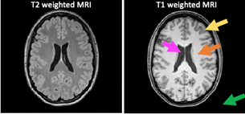

# Image Segmentation


## Exercise 1 
Display both the T1 and T2 images, their 1 and 2D histograms and scatter plots.
Tips: Use the `plt.imshow()`, `plt.hist()`, `plt.hist2d()` and `plt.scatter()` functions
Add relevant title and label for each axis. One can use `plt.subplots()` to show more subfigures in the same figure. **Remove intensities from background voxels for 1D and 2D histograms.**



The two MRI image modalities contain different types of intensity classes:

1. (Orange): The White Matter (WM) is the tissue type that contain the brain network - like the cables in the internet. The  WM ensure the communication flow between functional brain regions.
2. (Yellow): The Grey Matter (GM) is the tissue type that contain the cell bodies at the end of the brain network and are the functional units in the brain. The functional units are like CPUs in the computer. They are processing our sensorial input and are determining a reacting to these. It could be to start running.
3. (Magenta): Cerebrospinal fluid (CSF) which is the water in the brain 
4. (Green): Background of the image

**Q1**: What is the intensity threshold that can separate the GM and WM classes (roughly) from the 1D histograms? 

**Q2**: Can the GM and WM intensity classes be observed in the 2D histogram and scatter plot?

<!-- START_SOLUTION 1 -->
<!-- END_SOLUTION 1 -->

## Exercise 2
Place trainings examples i.e. ROI_WM and ROI_GM into variables C1 and C2 representing class 1 and class 2 respectively. Show in a figure the manually expert drawings of the C1 and C2 training examples.

??? TIP
    Use `plt.imshow()`

**Q3**: Does the ROI drawings look like what you expect from an expert? 

<!-- START_SOLUTION 2 -->
<!-- END_SOLUTION 2 -->

## Exercise 3
For each binary training ROI find the corresponding training examples in ImgT1 and ImgT2. Later these will be extracted for LDA training.

??? TIP
    If you are a MATLAB-like programming lover, you may use the `np.argwhere()` function appropriately to return the index to voxels in the image full filling e.g. intensity values >0 hence belong to a given class. Name the index variables qC1 and qC2, respectively.

**Q4**: What is the difference between the 1D histogram of the training examples and the 1D histogram of the whole image? Is the difference expected?

<!-- START_SOLUTION 3 -->
<!-- END_SOLUTION 3 -->

## Exercise 4
Make a training data vector (X) and target class vector (T) as input for the `LDA()` function. T and X should have the same length of data points.

**X**: Training data vector should first include all data points for class 1 and then the data points for class 2. Data points are the two input features ImgT1, ImgT2

**T**: Target class identifier for X where '0' are Class 1 and a '1' is Class 2.

??? TIP
    Read the documentation of the provided LDA function to understand the expected input dimensions.

<!-- START_SOLUTION 4 -->
<!-- END_SOLUTION 4 -->

## Exercise 5 
Make a scatter plot of the training points of the two input features for class 1 and class 2 as green and black circles, respectively. Add relevant title and labels to axis

**Q5**: How does the class separation appear in the 2D scatter plot compared with 1D histogram. Is it better?

<!-- START_SOLUTION 5 -->
<!-- END_SOLUTION 5 -->

## Exercise 6
Train the linear discriminant classifier using the Fisher discriminant function and estimate the weight-vector coefficient W (i.e. $w_0$ and $w$) for classification given X and T by using the `W=LDA()` function. The LDA function outputs W=[[w01, w1]; [w02, w2]] for class 1 and 2 respectively.

??? TIP
    Read the Bishop note on Chapter 4.

```python
W = LDA(X,T)
```

<!-- START_SOLUTION 6 -->
<!-- END_SOLUTION 6 -->

## Exercise 7
Apply the linear discriminant classifier i.e. perform multi-modal classification using the trained weight-vector $W$ for each class: It calculates the linear score $Y$ for **all** image data points within the brain slice i.e. $y(x)= w+w_0$. Actually, $y(x)$ is the $\log(P(Ci|x))$.

```python
Xall= np.c_[ImgT1.ravel(), ImgT2.ravel()]
Y = np.c_[np.ones((len(Xall), 1)), Xall] @ W.T
```

<!-- START_SOLUTION 7 -->
<!-- END_SOLUTION 7 -->

## Exercise 8
Perform multi-modal classification: Calculate the posterior probability i.e. $P(C_1|X)$ of a data point belonging to class 1

??? NOTE
    Using Bayes [Eq 1]: Since* $y(x)$ *is the log of the posterior probability [Eq2] we take* $\exp(y(x))$ *to get* $P(C_1|X)=P(X|\mu,\sigma)P(C_1)$ *and divide with the marginal probability* $P(X)$ *as normalisation factor.*

    ```python
    PosteriorProb = np.clip(np.exp(Y) / np.sum(np.exp(Y),1)[:, np.newaxis], 0, 1)
    ```

<!-- START_SOLUTION 8 -->
<!-- END_SOLUTION 8 -->

## Exercise 9
Apply segmentation: Find all voxles in the T1w and T2w image with $P(C_1|X)>0.5$ as belonging to Class 1. You may use the `np.where()` function. Similarly, find all voxels belonging to class 2.

<!-- START_SOLUTION 9 -->
<!-- END_SOLUTION 9 -->

## Exercise 10
Show scatter plot of segmentation results as in 5.

**Q6** Can you identify where the hyperplane is placed i.e. y(x)=0?

**Q7** Is the linear hyper plane positioned as you expected or would a non-linear hyper plane perform better?

**Q8** Would segmentation be as good as using a single image modality using thresholding?

**Q9** From the scatter plot does the segmentation results make sense? Are the two tissue types segmented correctly.

<!-- START_SOLUTION 10 -->
<!-- END_SOLUTION 10 -->

## Exercise 11

**Q10** Are the training examples representative for the segmentation results? Are you surprised that so few training examples perform so well? Do you need to be an anatomical expert to draw these?

**Q11** Compare the segmentation results with the original image. Are the segmentation results satisfactory? Why not?

**Q12** Is one class completely wrong segmented? What is the problem?

<!-- START_SOLUTION 11 -->
<!-- END_SOLUTION 11 -->


## Exam preparation 
Below are some example exam exercises related to this weeks material. Work with them, and if you have issues or questions, please ask the TAs, as you will not be able to get help after the last exercise round.


*Exam question 1: You are asked to design a system that can track skiers on a ski slope. Due to the weather, you can expect that the lightning conditions slowly changes during the slope opening times. What elements do you need in your image analysis system?*


- [ ] Estimation of a slowly changing background image, computing difference between current video frame and background, detection of significant changes in the image, analysis of moving objects.
- [ ] Conversion of image from RGB to grey scale, parametric classification of pixel values, image registration to a template figure
- [ ] Dynamic programming to find slope, image filtering to sort birds from the image, fast facial recognition to find skiers
- [ ] Do not know
- [ ] Image registration of slopes to a template slope, LDA classification of registration results, morphological closing of outlines
- [ ] Morphological opening of binary image from camera, median filtering of binary images, image rotation to get slope in the right camera view?


<!-- START_SOLUTION 12 -->
<!-- END_SOLUTION 12 -->

--- 

We have used data points from two classes in a two-dimensional space and trained a classifier model using two Gaussian distributions. The mean values are [24, 3] and [30, 7] for classes 1 and 2 respectively. As a classifier, we use the Linear Discriminant Classifier that assumes equal prior-probabilities and isotropic covariances. The covariance matrix is:

$$\bm{\Sigma} = \begin{bmatrix} 2 & 0\\ 0 & 2\end{bmatrix}$$

A general formulation for a hyperplane and points belonging to class 2 is:

$$\bm{y}_{C\in 2}(\bm{x}) = \bm{x}^T\bm{w}+\bm{cw}$$

where $w$ is the weight vector and $bm{cw}$ is the threshold defining the hyperplane. So, if $\bm{x}^T\bm{w}>\bm{cw}$ a sample point belongs to class 2.

*Exam question 2: What is $\bm{y}_{C\in 2}(\bm{x})$ for $\bm{x}=(23,5)$ and what class does the sample belong to?*

- [ ] -12 and class 1
- [ ] 170 and class 2
- [ ] -30 and class 1
- [ ] 12 and class 1
- [ ] Do not know
- [ ] -1.7 and class 2


<!-- START_SOLUTION 13 -->
<!-- END_SOLUTION 13 -->
